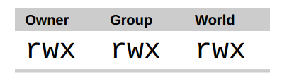
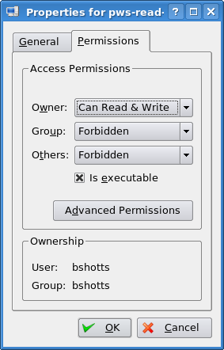
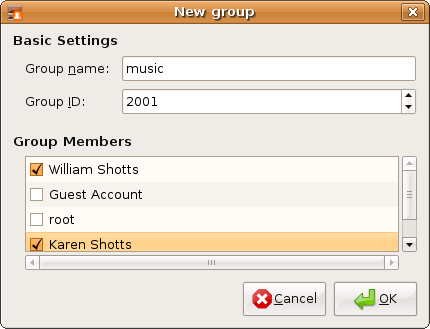

Operating systems in the Unix tradition differ from those in the MS-DOS tradition in
that they are not only multitasking systems, but also multi-user systems, as well.
What exactly does this mean? It means that more than one person can be using the
computer at the same time. While a typical computer will likely have only one keyboard
and monitor, it can still be used by more than one user. For example, if a computer is
attached to a network or the Internet, remote users can log in via ssh (secure shell) and
operate the computer. In fact, remote users can execute graphical applications and have
the graphical output appear on a remote display. The X Window System supports this as
part of its basic design.

Unix 传统中的操作系统不同于那些 MS-DOS 传统中的系统，区别在于它们不仅是多任务系统，而且也是
多用户系统。这到底意味着什么？它意味着多个用户可以在同一时间使用同一台计算机。然而一个
典型的计算机可能只有一个键盘和一个监视器，但是它仍然可以被多个用户使用。例如，如果一台
计算机连接到一个网络或者因特网，那么远程用户通过 ssh（安全 shell）可以登录并操纵这台电脑。
事实上，远程用户也能运行图形界面应用程序，并且图形化的输出结果会出现在远端的显示器上。
X 窗口系统把这个作为基本设计理念的一部分，并支持这种功能。

The multi-user capability of Linux is not a recent "innovation," but rather a feature that is
deeply embedded into the design of the operating system. Considering the environment
in which Unix was created, this makes perfect sense. Years ago, before computers were
"personal," they were large, expensive, and centralized. A typical university computer
system, for example, consisted of a large central computer located in one building and
terminals which were located throughout the campus, each connected to the large central
computer. The computer would support many users at the same time.

Linux 系统的多用户性能，不是最近的“创新”，而是一种特性，它深深地嵌入到了 Linux 操作系统的
设计过程中。想一下 Unix 系统的诞生环境，这会很有意义。多年前，在个人电脑出现之前，计算机
都是大型、昂贵的、集中化的。例如一个典型的大学计算机系统，是由坐落在一座建筑中的一台
大型中央计算机和许多散布在校园各处的终端机组成，每个终端都连接到这台大型中央计算机。
这台计算机可以同时支持很多用户。

In order to make this practical, a method had to be devised to protect the users from each
other. After all, the actions of one user could not be allowed to crash the computer, nor
could one user interfere with the files belonging to another user.

为了使多用户特性付诸实践，那么必须发明一种方法来阻止用户彼此之间受到影响。毕竟，一个
用户的行为不能导致计算机崩溃，也不能乱动属于另一个用户的文件。

In this chapter we are going to look at this essential part of system security and introduce
the following commands:

在这一章中，我们将看看这一系统安全的本质部分，会介绍以下命令：

* id – Display user identity

* id – 显示用户身份号

* chmod – Change a file's mode

* chmod – 更改文件模式

* umask – Set the default file permissions

* umask – 设置默认的文件权限

* su – Run a shell as another user

* su – 以另一个用户的身份来运行 shell

* sudo – Execute a command as another user

* sudo – 以另一个用户的身份来执行命令

* chown – Change a file's owner

* chown – 更改文件所有者

* chgrp – Change a file's group ownership

* chgrp – 更改文件组所有权

* passwd – Change a user's password

* passwd – 更改用户密码

### 拥有者、组成员和其他人

When we were exploring the system back in Chapter 4, we may have encountered a
problem when trying to examine a file such as /etc/shadow:

在第四章探究文件系统时，当我们试图查看一个像/etc/shadow 那样的文件的时候，我们会遇到一个问题。

    [me@linuxbox ~]$ file /etc/shadow
    /etc/shadow:  regular file, no read permission
    [me@linuxbox ~]$ less /etc/shadow
    /etc/shadow:  Permission denied

The reason for this error message is that, as regular users, we do not have permission to
read this file.

产生这种错误信息的原因是，作为一个普通用户，我们没有权限来读取这个文件。

In the Unix security model, a user may own files and directories. When a user owns a file
or directory, the user has control over its access. Users can, in turn, belong to a group
consisting of one or more users who are given access to files and directories by their
owners. In addition to granting access to a group, an owner may also grant some set of
access rights to everybody, which in Unix terms is referred to as the world. To find out
information about your identity, use the id command:

在 Unix 安全模型中，一个用户可能拥有文件和目录。当一个用户拥有一个文件或目录时，
用户对这个文件或目录的访问权限拥有控制权。用户反过来又属于一个由一个或多个
用户组成的用户组，用户组成员由文件和目录的所有者授予对文件和目录的访问权限。除了
对一个用户组授予权限之外，文件所有者可能会给每个人一些权限，在 Unix 术语中，每个人
是指整个世界。可以用 id 命令，来找到关于你自己身份的信息：

    [me@linuxbox ~]$ id
    uid=500(me) gid=500(me) groups=500(me)

Let's look at the output. When user accounts are created, users are assigned a number
called a user ID or uid which is then, for the sake of the humans, mapped to a user name.
The user is assigned a primary group ID or gid and may belong to additional groups. The
above example is from a Fedora system. On other systems, such as Ubuntu, the output
may look a little different:

让我们看一下输出结果。当用户创建帐户之后，系统会给用户分配一个号码，叫做用户 ID
或者 uid，然后，为了符合人类的习惯，这个 ID 映射到一个用户名。系统又会给这个用户
分配一个原始的组 ID 或者是 gid，这个 gid 可能属于另外的组。上面的例子来自于 Fedora 系统，
比方说 Ubuntu 的输出结果可能看起来有点儿不同：

    [me@linuxbox ~]$ id
    uid=1000(me) gid=1000(me)
    groups=4(adm),20(dialout),24(cdrom),25(floppy),29(audio),30(dip),44(v
    ideo),46(plugdev),108(lpadmin),114(admin),1000(me)

As we can see, the uid and gid numbers are different. This is simply because Fedora
starts its numbering of regular user accounts at 500, while Ubuntu starts at 1000. We can
also see that the Ubuntu user belongs to a lot more groups. This has to do with the way
Ubuntu manages privileges for system devices and services.

正如我们能看到的，两个系统中用户的 uid 和 gid 号码是不同的。原因很简单，因为 Fedora 系统
从500开始进行普通用户帐户的编号，而 Ubuntu 从1000开始。我们也能看到 Ubuntu 的用户属于
更多的用户组。这和 Ubuntu 管理系统设备和服务权限的方式有关系。

So where does this information come from? Like so many things in Linux, from a couple
of text files. User accounts are defined in the /etc/passwd file and groups are defined
in the /etc/group file. When user accounts and groups are created, these files are
modified along with /etc/shadow which holds information about the user's password.
For each user account, the /etc/passwd file defines the user (login) name, uid, gid,
the account's real name, home directory, and login shell. If you examine the contents of
/etc/passwd and /etc/group, you will notice that besides the regular user
accounts, there are accounts for the superuser (uid 0) and various other system users.

那么这些信息来源于哪里呢？像 Linux 系统中的许多东西一样，来自一系列的文本文件。用户帐户
定义在/etc/passwd 文件里面，用户组定义在/etc/group 文件里面。当用户帐户和用户组创建以后，
这些文件随着文件/etc/shadow 的变动而修改，文件/etc/shadow 包含了关于用户密码的信息。
对于每个用户帐号，文件/etc/passwd 定义了用户（登录）名、uid、gid、帐号的真实姓名、家目录
和登录 shell。如果你查看一下文件/etc/passwd 和文件/etc/group 的内容，你会注意到除了普通
用户帐号之外，还有超级用户（uid 0）帐号，和各种各样的系统用户。

In the next chapter, when we cover processes, you will see that some of these other
“users” are, in fact, quite busy.

在下一章中，当我们讨论进程时，你会知道这些其他的“用户”是谁，实际上，他们相当忙碌。

While many Unix-like systems assign regular users to a common group such as “users”,
modern Linux practice is to create a unique, single-member group with the same name as
the user. This makes certain types of permission assignment easier.

然而许多像 Unix 的系统会把普通用户分配到一个公共的用户组中，例如“users”，现在的 Linux
会创建一个独一无二的，只有一个成员的用户组，这个用户组与用户同名。这样使某种类型的
权限分配更容易些。

### 读取、写入和执行

Access rights to files and directories are defined in terms of read access, write access, and
execution access. If we look at the output of the ls command, we can get some clue as
to how this is implemented:

对于文件和目录的访问权力是根据读访问、写访问和执行访问来定义的。如果我们看一下 ls
命令的输出结果，我们能得到一些线索，这是怎样实现的：

    [me@linuxbox ~]$ > foo.txt
    [me@linuxbox ~]$ ls -l foo.txt
    -rw-rw-r-- 1 me   me   0 2008-03-06 14:52 foo.txt

The first ten characters of the listing are the file attributes. The first of these characters is
the file type. Here are the file types you are most likely to see (there are other, less
common types too):

列表的前十个字符是文件的属性。这十个字符的第一个字符表明文件类型。下表是你可能经常看到
的文件类型（还有其它的，不常见类型）：

<table class="multi">
<caption class="cap">Table 10-1: File Types</caption>
<tr>
<th class="title" width="15%">Attribute</th>
<th class="title">File Type</th>
</tr>
<tr>
<td valign="top">-</td>
<td valign="top">a regular file</td>
</tr>
<tr>
<td valign="top">d </td>
<td valign="top">A directory</td>
</tr>
<tr>
<td valign="top">l</td>
<td valign="top">A symbolic link. Notice that with symbolic links, the
remainning file attributes are always “rwxrwxrwx” and are dummy values. The
real file attributes are those of the file the symbolic link points to. </td>
</tr>
<tr>
<td valign="top">c</td>
<td valign="top">A character special file. This file type refers to a device that
handles data as a stream of bytes, such as a terminal or modem. </td>
</tr>
<tr>
<td valign="top">b</td>
<td valign="top">A block special file. This file type refers to a device that handles
data in blocks, such as a hard drive or CD-ROM drive. </td>
</tr>
</table>

<table class="multi">
<caption class="cap">表10-1: 文件类型</caption>
<tr>
<th class="title" width="15%">属性</th>
<th class="title">文件类型</th>
</tr>
<tr>
<td valign="top">-</td>
<td valign="top">一个普通文件</td>
</tr>
<tr>
<td valign="top">d </td>
<td valign="top">一个目录</td>
</tr>
<tr>
<td valign="top">l</td>
<td valign="top"> 一个符号链接。注意对于符号链接文件，剩余的文件属性总是"rwxrwxrwx"，而且都是
虚拟值。真正的文件属性是指符号链接所指向的文件的属性。</td>
</tr>
<tr>
<td valign="top">c</td>
<td valign="top"> 一个字符设备文件。这种文件类型是指按照字节流来处理数据的设备。
比如说终端机或者调制解调器</td>
</tr>
<tr>
<td valign="top">b</td>
<td valign="top"> 一个块设备文件。这种文件类型是指按照数据块来处理数据的设备，例如一个硬盘或者 CD-ROM 盘。 </td>
</tr>
</table>

The remaining nine characters of the file attributes, called the file mode, represent the
read, write, and execute permissions for the file's owner, the file's group owner, and
everybody else:

剩下的九个字符叫做文件模式，代表着文件所有者、文件组所有者和其他人的读、写和执行权限。

 \\
图 1: 权限属性
{: .figure}

When set, the r, w, and x mode attributes have the following effect on files and
directories:

当设置文件模式后，r、w和x 模式属性对文件和目录会产生以下影响：

<table class="multi">
<caption class="cap">Table 10-2: Permission Attributes</caption>
<tr>
<th class="title" width="15%">Attribute</th>
<th class="title">Files</th>
<th class="title">Directories</th>
</tr>
<tr>
<td valign="top">r</td>
<td valign="top">Allows a file to be opened and read.</td>
<td valign="top">Allows a directory's contents to be listed if the execute attribute is also set.</td>
</tr>
<tr>
<td valign="top">w</td>
<td valign="top">Allows a file to be written to or truncated, however this attribute does not allow files to be renamed or deleted. The ability to delete or rename files is determined by directory attributes.</td>
<td valign="top">Allows files within a directory to be created, deleted, and renamed if the execute attribute is also set.</td>
</tr>
<tr>
<td valign="top">x</td>
<td valign="top">Allows a file to be treated as a program and executed. Program files written in scripting languages must also be set as readable to be executed.</td>
<td valign="top">Allows a directory to be entered, e.g., cd directory.</td>
</tr>
</table>

<table class="multi">
<caption class="cap">表 10-2: 权限属性</caption>
<tr>
<th class="title" width="15%">属性</th>
<th class="title">文件</th>
<th class="title">目录</th>
</tr>
<tr>
<td valign="top">r</td>
<td valign="top">允许打开并读取文件内容。</td>
<td valign="top">允许列出目录中的内容，前提是目录必须设置了可执行属性（x）。</td>
</tr>
<tr>
<td valign="top">w</td>
<td valign="top">允许写入文件内容或截断文件。但是不允许对文件进行重命名或删除，重命名或删除是由目录的属性决定的。</td>
<td valign="top">允许在目录下新建、删除或重命名文件，前提是目录必须设置了可执行属性（x）。</td>
</tr>
<tr>
<td valign="top">x</td>
<td valign="top">允许将文件作为程序来执行，使用脚本语言编写的程序必须设置为可读才能被执行。</td>
<td valign="top">允许进入目录，例如：cd directory 。</td>
</tr>
</table>

Here are some examples of file attribute settings:

下面是权限属性的一些例子：

<table class="multi">
<caption class="cap">Table 10-3: Permission Attribute Examples</caption>
<tr>
<th class="title" width="15%">File Attributes</th>
<th class="title">Meaning</th>
</tr>
<tr>
<td valign="top">-rwx------</td>
<td valign="top">A regular file that is readable, writable, and executable by the file's owner. No one else has any access.</td>
</tr>
<tr>
<td valign="top">-rw-------</td>
<td valign="top">A regular file that is readable and writable by the file's owner. No one else has any access.</td>
</tr>
<tr>
<td valign="top">-rw-r--r--</td>
<td valign="top">A regular file that is readable and writable by the file's owner. Members of the file's owner group may read the file. The file is world-readable.</td>
</tr>
<tr>
<td valign="top">-rwxr-xr-x</td>
<td valign="top">A regular file that is readable, writable, and executable by the file's owner. The file may be read and executed by everybody else.</td>
</tr>
<tr>
<td valign="top">-rw-rw----</td>
<td valign="top">A regular file that is readable and writable by the file's owner and members of the file's group owner only.</td>
</tr>
<tr>
<td valign="top">lrwxrwxrwx</td>
<td valign="top">A symbolic link. All symbolic links have “dummy” permissions. The real permissions are kept with the actual file pointed to by the symbolic link.</td>
</tr>
<tr>
<td valign="top">drwxrwx---</td>
<td valign="top">A directory. The owner and the members of the owner group may enter the directory and, create, rename and remove files within the directory.</td>
</tr>
<tr>
<td valign="top">drwxr-x---</td>
<td valign="top">A directory. The owner may enter the directory and create, rename and delete files within the directory. Members of the owner group may enter the directory but cannot create, delete or rename files.</td>
</tr>
</table>

<table class="multi">
<caption class="cap">表 10-3: 权限属性示例</caption>
<tr>
<th class="title" width="15%">文件属性</th>
<th class="title">含义</th>
</tr>
<tr>
<td valign="top">-rwx------</td>
<td valign="top">一个普通文件，对文件所有者来说可读、可写、可执行。其他人无法访问。</td>
</tr>
<tr>
<td valign="top">-rw-------</td>
<td valign="top">一个普通文件，对文件所有者来说可读可写。其他人无法访问。</td>
</tr>
<tr>
<td valign="top">-rw-r--r--</td>
<td valign="top">一个普通文件，对文件所有者来说可读可写，文件所有者的组成员可以读该文件，其他所有人都可以读该文件。</td>
</tr>
<tr>
<td valign="top">-rwxr-xr-x</td>
<td valign="top">一个普通文件，对文件所有者来说可读、可写、可执行。也可以被其他的所有人读取和执行。</td>
</tr>
<tr>
<td valign="top">-rw-rw----</td>
<td valign="top">一个普通文件，对文件所有者以及文件所有者的组成员来说可读可写。</td>
</tr>
<tr>
<td valign="top">lrwxrwxrwx</td>
<td valign="top">一个符号链接，符号链接的权限都是虚拟的，真实的权限应该以符号链接指向的文件为准。</td>
</tr>
<tr>
<td valign="top">drwxrwx---</td>
<td valign="top">一个目录，文件所有者以及文件所有者的组成员可以访问该目录，并且可以在该目录下新建、重命名、删除文件。</td>
</tr>
<tr>
<td valign="top">drwxr-x---</td>
<td valign="top">一个目录，文件所有者可以访问该目录，并且可以在该目录下新建、重命名、删除文件，文件所有者的组成员可以访问该目录，但是不能新建、重命名、删除文件。</td>
</tr>
</table>

### chmod － 更改文件模式

To change the mode (permissions) of a file or directory, the chmod command is used.
Be aware that only the file’s owner or the superuser can change the mode of a file or
directory. chmod supports two distinct ways of specifying mode changes: octal number
representation, or symbolic representation. We will cover octal number representation
first.

更改文件或目录的模式（权限），可以利用 chmod 命令。注意只有文件的所有者或者超级用户才
能更改文件或目录的模式。chmod 命令支持两种不同的方法来改变文件模式：八进制数字表示法或
符号表示法。首先我们讨论一下八进制数字表示法。

> What The Heck Is Octal?
>
> 究竟什么是八进制？
>
>
> Octal (base 8), and its cousin, hexadecimal (base 16) are number systems
often used to express numbers on computers. We humans, owing to the fact that we (or
at least most of us) were born with ten fingers, count using a base 10 number
system. Computers, on the other hand, were born with only one finger
and thus do all their counting in binary (base 2). Their number system only
has two numerals, zero and one. So in binary, counting looks like this:
>
> 八进制（以8为基数）及其亲戚十六进制（以16为基数）都是数字系统，通常
被用来表示计算机中的数字。我们人类，因为这个事实（或者至少大多数人）天生具有
十个手指，利用以10为基数的数字系统来计数。计算机，从另一方面讲，生来只有一个
手指，因此它以二进制（以2为基数）来计数。它们的数字系统只有两个数值，0和1。
因此在二进制中，计数看起来像这样：
>
>  0, 1, 10, 11, 100, 101, 110, 111, 1000, 1001, 1010, 1011...
>
> In octal, counting is done with the numerals zero through seven, like so:
>
> 在八进制中，逢八进一，用数字0到7来计数，像这样：
>
>  0, 1, 2, 3, 4, 5, 6, 7, 10, 11, 12, 13, 14, 15, 16, 17, 20, 21...
>
> Hexadecimal counting uses the numerals zero through nine plus the letters “A” through “F”:
>
> 十六进制中，使用数字0到9，加上大写字母"A"到"F"来计数，逢16进一：
>
>  0, 1, 2, 3, 4, 5, 6, 7, 8, 9, A, B, C, D, E, F, 10, 11, 12, 13...
>
> While we can see the sense in binary (since computers only have one finger),
what are octal and hexadecimal good for? The answer has to do with human
convenience. Many times, small portions of data are represented on computers
as bit patterns. Take for example an RGB color. On most computer displays, each
pixel is composed of three color components: eight bits of red, eight bits of
green, and eight bits of blue. A lovely medium blue would be a twenty-four digit
number:
>
> 虽然我们能知道二进制的意义（因为计算机只有一个手指），但是八进制和十六进制对什么
好处呢？ 答案是为了人类的便利。许多时候，在计算机中，一小部分数据以二进制的形式表示。
以 RGB 颜色为例来说明。大多数的计算机显示器，每个像素由三种颜色组成：8位红色，8位绿色，
8位蓝色。这样，一种可爱的中蓝色就由24位数字来表示：
>
>  010000110110111111001101
>
> How would you like to read and write those kinds of numbers all day? I
didn't think so. Here's where another number system would help. Each digit in a
hexadecimal number represents four digits in binary. In octal, each digit
represents three binary digits. So our twenty-four digit medium blue could be
condensed down to a six digit hexadecimal number:
>
> 我不认为你每天都喜欢读写这类数字。另一种数字系统对我们更有帮助。每个十六进制
数字代表四个二进制。在八进制中，每个数字代表三个二进制数字。那么代表中蓝色的24位
二进制能够压缩成6位十六进制数：
>
>  436FCD
>
> Since the digits in the hexadecimal number “line up” with the bits in the binary
number we can see that the red component of our color is “43”, the green “6F”, and the blue “CD”.
>
> 因为十六进制中的两个数字对应二进制的8位数字，我们可以看到”43“代表红色，“6F”
代表绿色，“CD”代表蓝色。
>
> These days, hexadecimal notation (often spoken as “hex”) is more common than
octal, but as we shall soon see, octal's ability to express three bits of binary will
be very useful...
>
> 现在，十六进制表示法（经常叫做“hex”）比八进制更普遍，但是我们很快会看到，用八进制
来表示3个二进制数非常有用处...

With octal notation we use octal numbers to set the pattern of desired permissions. Since
each digit in an octal number represents three binary digits, this maps nicely to the
scheme used to store the file mode. This table shows what we mean:

通过八进制表示法，我们使用八进制数字来设置所期望的权限模式。因为每个八进制数字代表了
3个二进制数字，这种对应关系，正好映射到用来存储文件模式所使用的方案上。下表展示了
我们所要表达的意思：

|Octal| Binary | File Mode|
|0 | 000 | -\-\-|
|1 | 001 | -\-x|
|2 | 010 | -w-|
|3 | 011 | -wx|
|4 | 100 | r-\-|
|5 | 101 | r-x|
|6 | 110 | rw-|
|7 | 111 | rwx|

By using three octal digits, we can set the file mode for the owner, group owner, and
world:

通过使用3个八进制数字，我们能够设置文件所有者、用户组和其他人的权限：

    [me@linuxbox ~]$ > foo.txt
    [me@linuxbox ~]$ ls -l foo.txt
    -rw-rw-r-- 1 me    me    0  2008-03-06 14:52 foo.txt
    [me@linuxbox ~]$ chmod 600 foo.txt
    [me@linuxbox ~]$ ls -l foo.txt
    -rw------- 1 me    me    0  2008-03-06 14:52 foo.txt

By passing the argument “600”, we were able to set the permissions of the owner to read
and write while removing all permissions from the group owner and world. Though
remembering the octal to binary mapping may seem inconvenient, you will usually only
have to use a few common ones: 7 (rwx), 6 (rw-), 5 (r-x), 4 (r-\-), and 0 (-\-\-).

通过传递参数 “600”，我们能够设置文件所有者的权限为读写权限，而删除用户组和其他人的所有
权限。虽然八进制到二进制的映射看起来不方便，但通常只会用到一些常见的映射关系：
7 (rwx)，6 (rw-)，5 (r-x)，4 (r-\-)，和 0 (-\-\-)。

chmod also supports a symbolic notation for specifying file modes. Symbolic notation is
divided into three parts: who the change will affect, which operation will be performed,
and what permission will be set. To specify who is affected, a combination of the
characters “u”, “g”, “o”, and “a” is used as follows:

chmod 命令支持一种符号表示法，来指定文件模式。符号表示法分为三部分：更改会影响谁，
要执行哪个操作，要设置哪种权限。通过字符 “u”、“g”、“o”和 “a” 的组合来指定
要影响的对象，如下所示：

<table class="multi">
<caption class="cap">Table 10-4: chmod Symbolic Notation</caption>
<tr>
<td class="title" width="15%">u</td>
<td class="title">Short for "user", but means the file or directory owner.</td>
</tr>
<tr>
<td valign="top">g</td>
<td valign="top">Group owner.</td>
</tr>
<tr>
<td valign="top">o</td>
<td valign="top">Short for "others", but means world.</td>
</tr>
<tr>
<td valign="top">a</td>
<td valign="top">Short for "all", the combination of "u", "g", and "o".</td>
</tr>
</table>

<table class="multi">
<caption class="cap">表10-4: chmod 命令符号表示法 </caption>
<tr>
<td class="title" width="15%">u</td>
<td class="title"> "user"的简写，意思是文件或目录的所有者。</td>
</tr>
<tr>
<td valign="top">g</td>
<td valign="top"> 用户组。</td>
</tr>
<tr>
<td valign="top">o</td>
<td valign="top"> "others"的简写，意思是其他所有的人。</td>
</tr>
<tr>
<td valign="top">a</td>
<td valign="top"> "all"的简写，是"u", "g"和“o”三者的联合。</td>
</tr>
</table>

If no character is specified, “all” will be assumed. The operation may be a “+” indicating
that a permission is to be added, a “-” indicating that a permission is to be taken away, or
a “=” indicating that only the specified permissions are to be applied and that all others
are to be removed.

如果没有指定字符，则假定使用"all"。执行的操作可能是一个“＋”字符，表示加上一个权限，
一个“－”，表示删掉一个权限，或者是一个“＝”，表示只有指定的权限可用，其它所有的权限被删除。

Permissions are specified with the “r”, “w”, and “x” characters. Here are some examples
of symbolic notation:

权限由 “r”、“w”和 “x” 来指定。这里是一些符号表示法的实例：

<table class="multi">
<caption class="cap">Table 10-5: chmod Symbolic Notation Examples</caption>
<tr>
<td class="title" width="15%">u+x </td>
<td class="title">Add execute permission for the owner.</td>
</tr>
<tr>
<td valign="top">u-x</td>
<td valign="top">Remove execute permission from the owner.</td>
</tr>
<tr>
<td valign="top">+x</td>
<td valign="top">Add execute permission for the owner, group, and world.
Equivalent to a+x.</td>
</tr>
<tr>
<td valign="top">o-rw</td>
<td valign="top">Remove the read and write permission from anyone besides the
owner and group owner.</td>
</tr>
<tr>
<td valign="top">go=rw</td>
<td valign="top">Set the group owner and anyone besides the owner to have read and
write permission. If either the group owner or world previously had
execute permissions, they are removed.</td>
</tr>
<tr>
<td valign="top">u+x,go=rw</td>
<td valign="top">Add execute permission for the owner and set the permissions for
the group and others to read and execute. Multiple specifications may be separated by commas.</td>
</tr>
</table>
<table class="multi">
<caption class="cap">表10-5: chmod 符号表示法实例 </caption>
<tr>
<td class="title" width="15%">u+x </td>
<td class="title"> 为文件所有者添加可执行权限。</td>
</tr>
<tr>
<td valign="top">u-x</td>
<td valign="top"> 删除文件所有者的可执行权限。</td>
</tr>
<tr>
<td valign="top">+x</td>
<td valign="top"> 为文件所有者，用户组，和其他所有人添加可执行权限。 等价于 a+x。</td>
</tr>
<tr>
<td valign="top">o-rw</td>
<td valign="top"> 除了文件所有者和用户组，删除其他人的读权限和写权限。</td>
</tr>
<tr>
<td valign="top">go=rw</td>
<td valign="top"> 给群组的主人和任意文件拥有者的人读写权限。如果群组的主人或全局之前已经有了执行的权限，他们将被移除。 </td>
</tr>
<tr>
<td valign="top">u+x,go=rw</td>
<td valign="top"> 给文件拥有者执行权限并给组和其他人读和执行的权限。多种设定可以用逗号分开。</td>
</tr>
</table>

Some people prefer to use octal notation, some folks really like the symbolic. Symbolic
notation does offer the advantage of allowing you to set a single attribute without
disturbing any of the others.

一些人喜欢使用八进制表示法，而另一些人则非常喜欢符号表示法。符号表示法的优点是，
允许你设置文件模式的某个属性，而不影响其他的属性。

Take a look at the chmod man page for more details and a list of options. A word of
caution regarding the “--recursive” option: it acts on both files and directories, so it's not
as useful as one would hope since, we rarely want files and directories to have the same
permissions.

看一下 chmod 命令的手册页，可以得到更详尽的信息和 chmod 命令的各个选项。要注意"-\-recursive"选项：
它可以同时作用于文件和目录，所以它并不是如我们期望的那么有用处，因为我们很少希望文件和
目录拥有同样的权限。

### 借助 GUI 来设置文件模式

Now that we have seen how the permissions on files and directories are set, we can better
understand the permission dialogs in the GUI. In both Nautilus (GNOME) and
Konqueror (KDE), right-clicking a file or directory icon will expose a properties dialog.
Here is an example from KDE 3.5:

现在我们已经知道了怎样设置文件和目录的权限，这样我们就可以更好的理解 GUI 中的设置
权限对话框。在 Nautilus (GNOME)和 Konqueror
(KDE)中，右击一个文件或目录图标将会弹出一个属性对话框。下面这个例子来自 KDE 3.5：

 \\
图 2: KDE 3.5 文件属性对话框
{: .figure}

Here we can see the settings for the owner, group, and world. In KDE, clicking on the
“Advanced Permissions” button brings up another dialog that allows you to set each of
the mode attributes individually. Another victory for understanding brought to us by the
command line!

从这个对话框中，我们看到可以设置文件所有者、用户组和其他人的访问权限。
在 KDE 中，右击"Advanced Permissions"按钮，会打开另一个对话框，这个对话框允许
你单独设置各个模式属性。这也可以通过命令行来理解！

### umask － 设置默认权限

The umask command controls the default permissions given to a file when it is created.
It uses octal notation to express a mask of bits to be removed from a file's mode
attributes. Let's take a look:

当创建一个文件时，umask 命令控制着文件的默认权限。umask 命令使用八进制表示法来表达
从文件模式属性中删除一个位掩码。大家看下面的例子：

    [me@linuxbox ~]$ rm -f foo.txt
    [me@linuxbox ~]$ umask
    0002
    [me@linuxbox ~]$ > foo.txt
    [me@linuxbox ~]$ ls -l foo.txt
    -rw-rw-r-- 1 me   me   0 2008-03-06 14:53 foo.txt

We first removed any old copy of foo.txt to make sure we were starting fresh. Next,
we ran the umask command without an argument to see the current value. It responded
with the value 0002 (the value 0022 is another common default value), which is the
octal representation of our mask. We next create a new instance of the file foo.txt and
observe its permissions.

首先，删除文件 foo.txt，以此确定我们从新开始。下一步，运行不带参数的 umask 命令，
看一下当前的掩码值。响应的数值是0002（0022是另一个常用值），这个数值是掩码的八进制
表示形式。下一步，我们创建文件 foo.txt，并且保留它的权限。

We can see that both the owner and group both get read and write permission, while
everyone else only gets read permission. The reason that world does not have write
permission is because of the value of the mask. Let's repeat our example, this time
setting the mask ourselves:

我们可以看到文件所有者和用户组都得到读权限和写权限，而其他人只是得到读权限。
其他人没有得到写权限的原因是由掩码值决定的。重复我们的实验，这次自己设置掩码值：

    [me@linuxbox ~]$ rm foo.txt
    [me@linuxbox ~]$ umask 0000
    [me@linuxbox ~]$ > foo.txt
    [me@linuxbox ~]$ ls -l foo.txt
    -rw-rw-rw- 1 me   me    0 2008-03-06 14:58 foo.txt

When we set the mask to 0000 (effectively turning it off), we see that the file is now
world writable. To understand how this works, we have to look at octal numbers again.
If we take the mask and expand it into binary, then compare it to the attributes we can see
what happens:

当掩码设置为0000（实质上是关掉它）之后，我们看到其他人能够读写文件。为了弄明白这是
怎么回事，我们需要看一下掩码的八进制形式。把掩码展开成二进制形式，然后与文件属性
相比较，看看有什么区别：

|Original file mode | -\-\- rw- rw- rw-|
|Mask | 000 000 000 010|
|Result | -\-- rw- rw- r-\-|

Ignore for the moment the leading zeros (we'll get to those in a minute) and observe that
where the 1 appears in our mask, an attribute was removed—in this case, the world
write permission. That's what the mask does. Everywhere a 1 appears in the binary value
of the mask, an attribute is unset. If we look at a mask value of 0022, we can see what it
does:

此刻先忽略掉开头的三个零（我们一会儿再讨论），注意掩码中若出现一个数字1，则
删除文件模式中和这个1在相同位置的属性，在这是指其他人的写权限。这就是掩码要完成的
任务。掩码的二进制形式中，出现数字1的位置，相应地关掉一个文件模式属性。看一下
掩码0022的作用：

|Original file mode | -\-\- rw- rw- rw-|
|Mask | 000 000 010 010|
|Result | -\-- rw- r-\- r-\-|

Again, where a 1 appears in the binary value, the corresponding attribute is unset. Play
with some values (try some sevens) to get used to how this works. When you're done,
remember to clean up:

又一次，二进制中数字1出现的位置，相对应的属性被删除。再试一下其它的掩码值（一些带数字7的）
，习惯于掩码的工作原理。当你实验完成之后，要记得清理现场：

    [me@linuxbox ~]$ rm foo.txt; umask 0002

Most of the time you won't have to change the mask; the default provided by your
distribution will be fine. In some high-security situations, however, you will want to
control it.

大多数情况下，你不必修改掩码值，系统提供的默认掩码值就很好了。然而，在一些高
安全级别下，你要能控制掩码值。

> Some Special Permissions
>
> 一些特殊权限
>
> Though we usually see an octal permission mask expressed as a three digit
number, it is more technically correct to express it in four digits. Why? Because,
in addition to read, write, and execute permission, there are some other, less used,
permission settings.
>
> 虽然我们通常看到一个八进制的权限掩码用三位数字来表示，但是从技术层面上来讲，
用四位数字来表示它更确切些。为什么呢？因为除了读取、写入和执行权限之外，还有
其它较少用到的权限设置。
>
> The first of these is the setuid bit (octal 4000). When applied to an executable
file, it sets the effective user ID from that of real user (the user actually running
the program) to that of the program's owner. Most often this is given to a few
programs owned by the superuser. When an ordinary user runs a program that is
“setuid root” , the program runs with the effective privileges of the superuser.
This allows the program to access files and directories that an ordinary user
would normally be prohibited from accessing. Clearly, because this raises
security concerns, number of setuid programs must be held to an absolute
minimum.
>
> 其中之一是 setuid 位（八进制4000）。当应用到一个可执行文件时，它把有效用户 ID
从真正的用户（实际运行程序的用户）设置成程序所有者的 ID。这种操作通常会应用到
一些由超级用户所拥有的程序。当一个普通用户运行一个程序，这个程序由根用户(root)
所有，并且设置了 setuid 位，这个程序运行时具有超级用户的特权，这样程序就可以
访问普通用户禁止访问的文件和目录。很明显，因为这会引起安全方面的问题，所有可以
设置 setuid 位的程序个数，必须控制在绝对小的范围内。
>
> The second is the setgid bit (octal 2000) which, like the setuid bit, changes the
effective group ID from the real group ID of the user to that of the file owner. If
the setgid bit is set on a directory, newly created files in the directory will be
given the group ownership of the directory rather the group ownership of the file's
creator. This is useful in a shared directory when members of a common group
need access to all the files in the directory, regardless of the file owner's primary
group.
>
> 第二个是 setgid 位（八进制2000），这个相似于 setuid 位，把有效用户组 ID 从真正的
用户组 ID 更改为文件所有者的组 ID。如果设置了一个目录的 setgid 位，则目录中新创建的文件
具有这个目录用户组的所有权，而不是文件创建者所属用户组的所有权。对于共享目录来说，
当一个普通用户组中的成员，需要访问共享目录中的所有文件，而不管文件所有者的主用户组时，
那么设置 setgid 位很有用处。
>
> The third is called the sticky bit (octal 1000). This is a holdover from ancient
Unix, where it was possible to mark an executable file as “not swappable.” On
files, Linux ignores the sticky bit, but if applied to a directory, it prevents users
from deleting or renaming files unless the user is either the owner of the directory,
the owner of the file, or the superuser. This is often used to control access to a
shared directory, such as /tmp.
>
> 第三个是 sticky 位（八进制1000）。这个继承于 Unix，在 Unix 中，它可能把一个可执行文件
标志为“不可交换的”。在 Linux 中，会忽略文件的 sticky 位，但是如果一个目录设置了 sticky 位，
那么它能阻止用户删除或重命名文件，除非用户是这个目录的所有者，或者是文件所有者，或是
超级用户。这个经常用来控制访问共享目录，比方说/tmp。
>
> Here are some examples of using chmod with symbolic notation to set these
special permissions. First assigning setuid to a program:
>
> 这里有一些例子，使用 chmod 命令和符号表示法，来设置这些特殊的权限。首先，
授予一个程序 setuid 权限。
>
>  _chmod u+s program_
>
> Next, assigning setgid to a directory:
>
> 下一步，授予一个目录 setgid 权限：
>
>  _chmod g+s dir_
>
> Finally, assigning the sticky bit to a directory:
>
> 最后，授予一个目录 sticky 权限：
>
>  _chmod +t dir_
>
> When viewing the output from ls, you can determine the special permissions.
Here are some examples. First, a program that is setuid:
>
> 当浏览 ls 命令的输出结果时，你可以确认这些特殊权限。这里有一些例子。首先，一个程序被设置为setuid属性：
>
>  _-rwsr-xr-x_
>
> A directory that has the setgid attribute:
>
> 具有 setgid 属性的目录：
>
>  _drwxrwsr-x_
>
> A directory with the sticky bit set:
>
> 设置了 sticky 位的目录：
>
>  _drwxrwxrwt_

### 更改身份

At various times, we may find it necessary to take on the identity of another user. Often
we want to gain superuser privileges to carry out some administrative task, but it is also
possible to “become” another regular user for such things as testing an account. There
are three ways to take on an alternate identity:

在不同的时候，我们会发现很有必要具有另一个用户的身份。经常地，我们想要得到超级
用户特权，来执行一些管理任务，但是也有可能"变为"另一个普通用户，比如说测试一个帐号。
有三种方式，可以拥有多重身份：

1. Log out and log back in as the alternate user.

2. Use the su command.

3. Use the sudo command.

^
1. 注销系统并以其他用户身份重新登录系统。

2. 使用 su 命令。

3. 使用 sudo 命令。

We will skip the first technique since we know how to do it and it lacks the convenience
of the other two. From within our own shell session, the su command allows you to
assume the identity of another user, and either start a new shell session with that user's
IDs, or to issue a single command as that user. The sudo command allows an
administrator to set up a configuration file called /etc/sudoers, and define specific
commands that particular users are permitted to execute under an assumed identity. The
choice of which command to use is largely determined by which Linux distribution you
use. Your distribution probably includes both commands, but its configuration will favor
either one or the other. We'll start with su.

我们将跳过第一种方法，因为我们知道怎样使用它，并且它缺乏其它两种方法的方便性。
在我们自己的 shell 会话中，su 命令允许你假定为另一个用户的身份，以这个用户的 ID
启动一个新的 shell 会话，或者是以这个用户的身份来发布一个命令。sudo 命令允许一个管理员
设置一个叫做/etc/sudoers 的配置文件，并且定义了一些具体命令，在假定的身份下，特殊用户
可以执行这些命令。选择使用哪个命令，很大程度上是由你使用的 Linux 发行版来决定的。
你的发行版可能这两个命令都包含，但系统配置可能会偏袒其中之一。我们先介绍 su 命令。

### su － 以其他用户身份和组 ID 运行一个 shell

The su command is used to start a shell as another user. The command syntax looks like
this:

su 命令用来以另一个用户的身份来启动 shell。这个命令语法看起来像这样：

    su [-[l]] [user]

If the “-l” option is included, the resulting shell session is a login shell for the specified
user. This means that the user's environment is loaded and the working directory is
changed to the user's home directory. This is usually what we want. If the user is not
specified, the superuser is assumed. Notice that (strangely) the “-l” may be abbreviated
“-”, which is how it is most often used. To start a shell for the superuser, we would do
this:

如果包含"-l"选项，那么会为指定用户启动一个需要登录的 shell。这意味着会加载此用户的 shell 环境，
并且工作目录会更改到这个用户的家目录。这通常是我们所需要的。如果不指定用户，那么就假定是
超级用户。注意（不可思议地），选项"-l"可以缩写为"-"，这是经常用到的形式。启动超级用户的 shell，
我们可以这样做：

    [me@linuxbox ~]$ su -
    Password:
    [root@linuxbox ~]#

After entering the command, we are prompted for the superuser's password. If it is
successfully entered, a new shell prompt appears indicating that this shell has superuser
privileges (the trailing “#” rather than a “$”) and the current working directory is now the
home directory for the superuser (normally /root.) Once in the new shell, we can carry
out commands as the superuser. When finished, type “exit” to return to the previous
shell:

按下回车符之后，shell 提示我们输入超级用户的密码。如果密码输入正确，出现一个新的 shell 提示符，
这表明这个 shell 具有超级用户特权（提示符的末尾字符是"#"而不是"$"），并且当前工作目录是超级用户的家目录
（通常是/root）。一旦进入一个新的 shell，我们能执行超级用户所使用的命令。当工作完成后，
输入"exit"，则返回到原来的 shell:

    [root@linuxbox ~]# exit
    [me@linuxbox ~]$

It is also possible to execute a single command rather than starting a new interactive
command by using su this way:

以这样的方式使用 su 命令，也可以只执行单个命令，而不是启动一个新的可交互的 shell：

    su -c 'command'

Using this form, a single command line is passed to the new shell for execution. It is
important to enclose the command in quotes, as we do not want expansion to occur in our
shell, but rather in the new shell:

使用这种模式，命令传递到一个新 shell 中执行。把命令用单引号引起来很重要，因为我们不想
命令在我们的 shell 中展开，但需要在新 shell 中展开。

    [me@linuxbox ~]$ su -c 'ls -l /root/*'
    Password:
    -rw------- 1 root root    754 2007-08-11 03:19 /root/anaconda-ks.cfg

    /root/Mail:
    total 0
    [me@linuxbox ~]$

### sudo － 以另一个用户身份执行命令

The sudo command is like su in many ways, but has some important additional
capabilities. The administrator can configure sudo to allow an ordinary user to execute
commands as a different user (usually the superuser) in a very controlled way. In
particular, a user may be restricted to one or more specific commands and no others.
Another important difference is that the use of sudo does not require access to the
superuser's password. To authenticate using sudo, the user uses his/her own password.
Let's say, for example, that sudo has been configured to allow us to run a fictitious
backup program called “backup_script”, which requires superuser privileges. With sudo
it would be done like this:

sudo 命令在很多方面都相似于 su 命令，但是 sudo 还有一些非常重要的功能。管理员能够配置
sudo 命令，从而允许一个普通用户以不同的身份（通常是超级用户），通过一种非常可控的方式
来执行命令。尤其是，只有一个用户可以执行一个或多个特殊命令时，（更体现了 sudo 命令的方便性）。
另一个重要差异是 sudo 命令不要求超级用户的密码。使用 sudo 命令时，用户使用他/她自己的密码
来认证。比如说，例如，sudo 命令经过配置，允许我们运行一个虚构的备份程序，叫做"backup_script"，
这个程序要求超级用户权限。通过 sudo 命令，这个程序会像这样运行：

    [me@linuxbox ~]$ sudo backup_script
    Password:
    System Backup Starting...

After entering the command, we are prompted for our password (not the superuser's) and
once the authentication is complete, the specified command is carried out. One important
difference between su and sudo is that sudo does not start a new shell, nor does it load
another user's environment. This means that commands do not need to be quoted any
differently than they would be without using sudo. Note that this behavior can be
overridden by specifying various options. See the sudo man page for details.

按下回车键之后，shell 提示我们输入我们的密码（不是超级用户的）。一旦认证完成，则执行
具体的命令。su 和 sudo 之间的一个重要区别是 sudo 不会重新启动一个 shell，也不会加载另一个
用户的 shell 运行环境。这意味者命令不必用单引号引起来。注意通过指定各种各样的选项，这
种行为可以被推翻。详细信息，阅读 sudo 手册页。

To see what privileges are granted by sudo, use the “-l” option to list them:

想知道 sudo 命令可以授予哪些权限，使用"-l"选项，列出所有权限：

    [me@linuxbox ~]$ sudo -l
    User me may run the following commands on this host:
    (ALL) ALL

> Ubuntu And sudo
>
> Ubuntu 与 sudo
>
> One of the recurrent problems for regular users is how to perform certain tasks
that require superuser privileges. These tasks include installing and updating
software, editing system configuration files, and accessing devices. In the
Windows world, this is often done by giving users administrative privileges. This
allows users to perform these tasks. However, it also enables programs executed
by the user to have the same abilities. This is desirable in most cases, but it also
permits malware (malicious software) such as viruses to have free reign of the
computer.
>
> 普通用户经常会遇到这样的问题，怎样完成某些需要超级用户权限的任务。这些任务
包括安装和更新软件，编辑系统配置文件，和访问设备。在 Windows 世界里，这些任务是
通过授予用户管理员权限来完成的。这允许用户执行这些任务。然而，这也会导致用户所
执行的程序拥有同样的能力。在大多数情况下，这是我们所期望的，但是它也允许 malware
（恶意软件），比方说电脑病毒，自由地支配计算机。
>
> In the Unix world, there has always been a larger division between regular users
and administrators, owing to the multi-user heritage of Unix. The approach taken
in Unix is to grant superuser privileges only when needed. To do this, the su and
sudo commands are commonly used.
>
> 在 Unix 世界中，由于 Unix 是多用户系统，所以在普通用户和管理员之间总是存在很大的
差别。Unix 采取的方法是只有在需要的时候，才授予普通用户超级用户权限。这样，普遍会
用到 su 和 sudo 命令。
>
> Up until a couple of years ago, most Linux distributions relied on su for this
purpose. su didn't require the configuration that sudo required, and having a
root account is traditional in Unix. This introduced a problem. Users were
tempted to operate as root unnecessarily. In fact, some users operated their
systems as the root user exclusively, since it does away with all those annoying
“permission denied” messages. This is how you reduce the security of a Linux
system to that of a Windows system. Not a good idea.
>
> 几年前，大多数的 Linux 发行版都依赖于 su 命令，来达到目的。su 命令不需要 sudo 命令
所要求的配置，su 命令拥有一个 root 帐号，是 Unix 中的传统。但这会引起问题。所有用户
会企图以 root 用户帐号来操纵系统。事实上，一些用户专门以 root 用户帐号来操作系统，
因为这样做，的确消除了所有那些讨厌的“权限被拒绝”的消息。你这样做就会使得 Linux 系统的
安全性能被降低到和 Windows 系统相同的级别。不是一个好主意。
>
> When Ubuntu was introduced, its creators took a different tack. By default,
Ubuntu disables logins to the root account (by failing to set a password for the
account), and instead uses sudo to grant superuser privileges. The initial user
account is granted full access to superuser privileges via sudo and may grant
similar powers to subsequent user accounts.
>
> 当引进 Ubuntu 的时候，它的创作者们采取了不同的策略。默认情况下，Ubuntu 不允许用户登录
到 root 帐号（因为不能为 root 帐号设置密码），而是使用 sudo 命令授予普通用户超级用户权限。
通过 sudo 命令，最初的用户可以拥有超级用户权限，也可以授予随后的用户帐号相似的权力。

### chown － 更改文件所有者和用户组

The chown command is used to change the owner and group owner of a file or directory.
Superuser privileges are required to use this command. The syntax of chown looks like
this:

chown 命令被用来更改文件或目录的所有者和用户组。使用这个命令需要超级用户权限。chown 命令
的语法看起来像这样：

    chown [owner][:[group]] file...

chown can change the file owner and/or the file group owner depending on the first
argument of the command. Here are some examples:

chown 可以根据这个命令的第一个参数更改文件所有者和/或文件用户组。这里有
一些例子：

<table class="multi">
<caption class="cap">Table 10-6: chown Argument Examples</caption>
<tr>
<th class="title">Argument </th>
<th class="title">Results</th>
</tr>
<tr>
<td valign="top" width="15%">bob</td>
<td valign="top">Changes the ownership of the file from its current owner to user bob.</td>
</tr>
<tr>
<td valign="top">bob:users</td>
<td valign="top">Changes the ownership of the file from its current owner to user
bob and changes the file group owner to group users.</td>
</tr>
<tr>
<td valign="top">:admins</td>
<td valign="top">Changes the group owner to the group admins. The file owner is unchanged.</td>
</tr>
<tr>
<td valign="top">bob:</td>
<td valign="top">Change the file owner from the current owner to user bob and
changes the group owner to the login group of user bob.</td>
</tr>
</table>
<table class="multi">
<caption class="cap">表10-6: chown 参数实例</caption>
<tr>
<th class="title">参数</th>
<th class="title">结果</th>
</tr>
<tr>
<td valign="top" width="15%">bob</td>
<td valign="top"> 把文件所有者从当前属主更改为用户 bob。</td>
</tr>
<tr>
<td valign="top">bob:users</td>
<td valign="top"> 把文件所有者改为用户 bob，文件用户组改为用户组 users。</td>
</tr>
<tr>
<td valign="top">:admins</td>
<td valign="top"> 把文件用户组改为组 admins，文件所有者不变。</td>
</tr>
<tr>
<td valign="top">bob:</td>
<td valign="top"> 文件所有者改为用户 bob，文件用户组改为用户 bob 登录系统时所属的用户组。</td>
</tr>
</table>

Let's say that we have two users; janet, who has access to superuser privileges and
tony, who does not. User janet wants to copy a file from her home directory to the
home directory of user tony. Since user janet wants tony to be able to edit the file,
janet changes the ownership of the copied file from janet to tony:

比方说，我们有两个用户，janet拥有超级用户访问权限，而 tony 没有。用户 jant 想要从
她的家目录复制一个文件到用户 tony 的家目录。因为用户 jant 想要 tony 能够编辑这个文件，
janet 把这个文件的所有者更改为 tony:

    [janet@linuxbox ~]$ sudo cp myfile.txt ~tony
    Password:
    [janet@linuxbox ~]$ sudo ls -l ~tony/myfile.txt
    -rw-r--r-- 1 root  root 8031 2008-03-20 14:30 /home/tony/myfile.txt
    [janet@linuxbox ~]$ sudo chown tony: ~tony/myfile.txt
    [janet@linuxbox ~]$ sudo ls -l ~tony/myfile.txt
    -rw-r--r-- 1 tony  tony 8031 2008-03-20 14:30 /home/tony/myfile.txt

Here we see user janet copy the file from her directory to the home directory of user
tony. Next, janet changes the ownership of the file from root (a result of using
sudo) to tony. Using the trailing colon in the first argument, janet also changed the
group ownership of the file to the login group of tony, which happens to be group
tony.

这里，我们看到用户 janet 把文件从她的目录复制到 tony 的家目录。下一步，janet 把文件所有者
从 root（使用 sudo 命令的原因）改到 tony。通过在第一个参数中使用末尾的":"字符，janet 同时把
文件用户组改为 tony 登录系统时，所属的用户组，碰巧是用户组 tony。

Notice that after the first use of sudo, janet was not prompted for her password? This
is because sudo, in most configurations, “trusts” you for several minutes until its timer
runs out.

注意，第一次使用 sudo 命令之后，为什么（shell）没有提示 janet 输入她的密码？这是因为，在
大多数的配置中，sudo 命令会相信你几分钟，直到计时结束。

### chgrp － 更改用户组所有权

In older versions of Unix, the chown command only changed file ownership, not group
ownership. For that purpose, a separate command, chgrp was used. It works much the
same way as chown, except for being more limited.

在旧版 Unix 系统中，chown 命令只能更改文件所有权，而不是用户组所有权。为了达到目的，
使用一个独立的命令，chgrp 来完成。除了限制多一点之外，chgrp 命令与 chown 命令使用起来很相似。

### 练习使用权限

Now that we have learned how this permissions thing works, it's time to show
it off. We are going to demonstrate the solution to a common problem — setting
up a shared   directory. Let's imagine that we have two users named “bill” and
“karen.” They both have music CD collections and wish to set up a shared
directory, where they will each store their music files as Ogg Vorbis or MP3.
User bill has access to superuser privileges via sudo.

到目前为止，我们已经知道了权限这类东西是怎样工作的，现在是时候炫耀一下了。我们
将展示一个常见问题的解决方案，这个问题是如何设置一个共享目录。假想我们有两个用户，
他们分别是 "bill" 和 "karen"。他们都有音乐 CD 收藏品，也愿意设置一个共享目录，在这个
共享目录中，他们分别以 Ogg Vorbis 或 MP3 的格式来存储他们的音乐文件。通过 sudo 命令，
用户 bill 具有超级用户访问权限。

The first thing that needs to happen is creating a group that will have both bill and
karen as members. Using the graphical user management tool, bill creates a group
called music and adds users bill and karen to it:

我们需要做的第一件事，是创建一个以 bill 和 karen 为成员的用户组。使用图形化的用户管理工具，
bill 创建了一个叫做 music 的用户组，并且把用户 bill 和 karen 添加到用户组 music 中：

 \\
图 3: 用 GNOME 创建一个新的用户组
{: .figure}

Next, bill creates the directory for the music files:

下一步，bill 创建了存储音乐文件的目录：

    [bill@linuxbox ~]$ sudo mkdir /usr/local/share/Music
    password:

Since bill is manipulating files outside his home directory, superuser privileges are
required. After the directory is created, it has the following ownerships and permissions:

因为 bill 正在他的家目录之外操作文件，所以需要超级用户权限。这个目录创建之后，它具有
以下所有权和权限：

    [bill@linuxbox ~]$ ls -ld /usr/local/share/Music
    drwxr-xr-x 2 root root 4096 2008-03-21 18:05 /usr/local/share/Music

As we can see, the directory is owned by root and has 755 permissions. To make this
directory sharable, bill needs to change the group ownership and the group permissions
to allow writing:

正如我们所见到的，这个目录由 root 用户拥有，并且具有权限755。为了使这个目录共享，允许（用户
karen）写入，bill 需要更改目录用户组所有权和权限：

    [bill@linuxbox ~]$ sudo chown :music /usr/local/share/Music
    [bill@linuxbox ~]$ sudo chmod 775 /usr/local/share/Music
    [bill@linuxbox ~]$ ls -ld /usr/local/share/Music
    drwxrwxr-x 2 root music 4096 2008-03-21 18:05 /usr/local/share/Music

So what does this all mean? It means that we now have a directory,
/usr/local/share/Music that is owned by root and allows read and write
access to group music. Group music has members bill and karen, thus bill and
karen can create files in directory /usr/local/share/Music. Other users can
list the contents of the directory but cannot create files there.

那么这是什么意思呢？
它的意思是，现在我们拥有一个目录，/usr/local/share/Music，这个目录由 root 用户拥有，并且
允许用户组 music 读取和写入。用户组 music 有两个成员 bill 和 karen，这样 bill 和 karen 能够在目录
/usr/local/share/Music 中创建文件。其他用户能够列出目录中的内容，但是不能在其中创建文件。

But we still have a problem. With the current permissions, files and directories created
within the Music directory will have the normal permissions of the users bill and
karen:

但是我们仍然会遇到问题。通过我们目前所拥有的权限，在 Music 目录中创建的文件，只具有用户 bill
和 karen 的普通权限：

    [bill@linuxbox ~]$ > /usr/local/share/Music/test_file
    [bill@linuxbox ~]$ ls -l /usr/local/share/Music
    -rw-r--r-- 1 bill    bill    0 2008-03-24 20:03 test_file

Actually there are two problems. First, the default umask on this system is 0022 which
prevents group members from writing files belonging to other members of the group.
This would not be a problem if the shared directory only contained files, but since this
directory will store music, and music is usually organized in a hierarchy of artists and
albums, members of the group will need the ability to create files and directories inside
directories created by other members. We need to change the umask used by bill and
karen to 0002 instead.

实际上，存在两个问题。第一个，系统中默认的掩码值是0022，这会禁止用户组成员编辑属于同
组成员的文件。如果共享目录中只包含文件，这就不是个问题，但是因为这个目录将会存储音乐，
通常音乐会按照艺术家和唱片的层次结构来组织分类。所以用户组成员需要在同组其他成员创建的
目录中创建文件和目录。我们将把用户 bill 和 karen 使用的掩码值改为0002。

Second, each file and directory created by one member will be set to the primary group of
the user rather than the group music. This can be fixed by setting the setgid bit on the
directory:

第二个问题是，用户组成员创建的文件和目录的用户组，将会设置为用户的主要组，而不是用户组 music。
通过设置此目录的 setgid 位来解决这个问题：

    [bill@linuxbox ~]$ sudo chmod g+s /usr/local/share/Music
    [bill@linuxbox ~]$ ls -ld /usr/local/share/Music
    drwxrwsr-x 2 root music 4096 2008-03-24 20:03 /usr/local/share/Music

Now we test to see if the new permissions fix the problem. bill sets his umask to
0002, removes the previous test file, creates a new test file and directory:

现在测试一下，看看是否新的权限解决了这个问题。bill 把他的掩码值设为0002，删除
先前的测试文件，并创建了一个新的测试文件和目录：

    [bill@linuxbox ~]$ umask 0002

    [bill@linuxbox ~]$ rm /usr/local/share/Music/test_file

    [bill@linuxbox ~]$ > /usr/local/share/Music/test_file
    [bill@linuxbox ~]$ mkdir /usr/local/share/Music/test_dir
    [bill@linuxbox ~]$ ls -l /usr/local/share/Music
    drwxrwsr-x 2 bill   music 4096 2008-03-24 20:24 test_dir
    -rw-rw-r-- 1 bill   music 0 2008-03-24 20:22 test_file
    [bill@linuxbox ~]$

Both files and directories are now created with the correct permissions to allow all
members of the group music to create files and directories inside the Music directory.

现在，创建的文件和目录都具有正确的权限，允许用户组 music 的所有成员在目录 Music 中创建
文件和目录。

The one remaining issue is umask. The necessary setting only lasts until the end of
session and must be reset. In the next part of the book, we'll look at making the change to
umask permanent.

剩下一个问题是关于 umask 命令的。umask 命令设置的掩码值只能在当前 shell 会话中生效，若当前 shell
会话结束后，则必须重新设置。在这本书的第三部分，我们将看一下，怎样使掩码值永久生效。

### 更改用户密码

The last topic we'll cover in this chapter is setting passwords for yourself (and for other
users if you have access to superuser privileges.) To set or change a password, the
passwd command is used. The command syntax looks like this:

这一章最后一个话题，我们将讨论自己帐号的密码（和其他人的密码，如果你具有超级用户权限）。
使用 passwd 命令，来设置或更改用户密码。命令语法如下所示：

    passwd [user]

To change your password, just enter the passwd command. You will be prompted for
your old password and your new password:

只要输入 passwd 命令，就能更改你的密码。shell 会提示你输入你的旧密码和你的新密码：

    [me@linuxbox ~]$ passwd
    (current) UNIX password:
    New UNIX password:

The passwd command will try to enforce use of “strong” passwords. This means the it
will refuse to accept passwords that are too short, too similar to previous passwords, are
dictionary words, or too easily guessed:

passwd 命令将会试着强迫你使用“强”密码。这意味着它会拒绝接受太短的密码、与先前相似的密码、
字典中的单词作为密码或者是太容易猜到的密码：

    [me@linuxbox ~]$ passwd
    (current) UNIX password:
    New UNIX password:
    BAD PASSWORD: is too similar to the old one
    New UNIX password:
    BAD PASSWORD: it is WAY too short
    New UNIX password:
    BAD PASSWORD: it is based on a dictionary word

If you have superuser privileges, you can specify a user name as an argument to the
passwd command to set the password for another user. There are other options
available to the superuser to allow account locking, password expiration, etc. See the
passwd man page for details.

如果你具有超级用户权限，你可以指定一个用户名作为 passwd 命令的参数，这样可以设置另一个
用户的密码。还有其它的 passwd 命令选项对超级用户有效，允许帐号锁定，密码失效，等等。
详细内容，参考 passwd 命令的手册页。

### 拓展阅读

* Wikipedia has a good article on malware:

* Wikipedia 上面有一篇关于 malware（恶意软件）好文章：

    <http://en.wikipedia.org/wiki/Malware>

There are number of command line programs used to create and maintain users and
groups. For more information, see the man pages for the following commands:

还有一系列的命令行程序，可以用来创建和维护用户和用户组。更多信息，查看以下命令的手册页：

* _adduser_

* _useradd_

* _groupadd_
