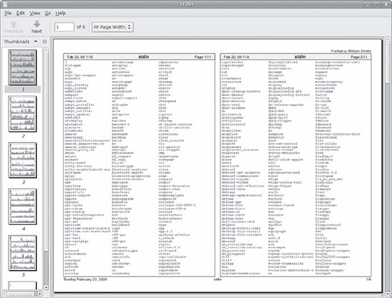

After spending the last couple of chapters manipulating text, it's time to put that text on paper. In this chapter, we'll look at the command-line tools that are used to print files and control printer operation. We won't be looking at how to configure printing, as that varies from distribution to distribution and is usually set up automatically during installation. Note that we will need a working printer configuration to perform the exercises in this chapter.

前几章我们学习了如何操控文本，下面要做的是将文本呈于纸上。在这章中，我们将会着手用于打印文件和控制打印选项的命令行工具。通常不同发行版的打印配置各有不同且都会在其安装时自动完成，因此这里我们不讨论打印的配置过程。本章的练习需要一台正确配置的打印机来完成。

We will discuss the following commands:

我们将讨论一下命令：

* pr——Convert text files for printing.

* pr —— 转换需要打印的文本文件

* lpr——Print files.

* lpr —— 打印文件

* lp——Print files (System V).

* lp —— 打印文件（System V）

* a2ps——Format files for printing on a PostScript printer.

* a2ps —— 为 PostScript 打印机格式化文件

* lpstat——Show printer status information.

* lpstat —— 显示打印机状态信息

* lpq——Show printer queue status.

* lpq —— 显示打印机队列状态

* lprm——Cancel print jobs.

* lprm —— 取消打印任务

* cancel——Cancel print jobs (System V).

* cancel —— 取消打印任务（System V）

### 打印简史

To fully understand the printing features found in Unix-like operating systems, we must first learn some history. Printing on Unix-like systems goes way back to the beginning of the operating system itself. In those days, printers and how they were used were much different from how they are today.

为了较好的理解类 Unix 操作系统中的打印功能，我们必须先了解一些历史。类 Unix 系统中的打印可追溯到操作系统本身的起源，那时候打印机和它的用法与今天截然不同。

#### 早期的打印

Like the computers themselves, printers in the pre-PC era tended to be large, expensive, and centralized. The typical computer user of 1980 worked at a terminal connected to a computer some distance away. The printer was located near the computer and was under the watchful eyes of the computer's operators.

和计算机一样，前 PC 时代的打印机都很大、很贵，并且很集中。1980年的计算机用户都是在离电脑很远的地方用一个连接电脑的终端来工作的，而打印机就放在电脑旁并受到计算机管理员的全方位监视。

When printers were expensive and centralized, as they often were in the early days of Unix, it was common practice for many users to share a printer. To identify print jobs belonging to a particular user, a banner page displaying the name of the user was often printed at the beginning of each print job. The computer support staff would then load up a cart containing the day's print jobs and deliver them to the individual users.

由于当时打印机既昂贵又集中，而且都工作在早期的 Unix 环境下，人们从实际考虑通常都会多人共享一台打印机。为了区别不同用户的打印任务，每个打印任务的开头都会打印一张写着用户名字的标题页，然后计算机工作人员会用推车装好当天的打印任务并分发给每个用户。

#### 基于字符的打印机

The printer technology of the '80s was very different in two respects. First, printers of that period were almost always impact printers. Impact printers use a mechanical mechanism that strikes a ribbon against the paper to form character impressions on the page. Two of the popular technologies of that time were daisy-wheel printing and dot-matrix printing.

80年代的打印机技术有两方面的不同。首先，那时的打印机基本上都是打击式打印机。打击式打印机使用撞针打击色带的机械结构在纸上形成字符。这种流行的技术造就了当时的菊轮式打印和点阵式打印。

The second, and more important, characteristic of early printers was that they used a fixed set of characters that were intrinsic to the device itself. For example, a daisy-wheel printer could print only the characters actually molded into the petals of the daisy wheel. This made the printers much like high-speed typewriters. As with most typewriters, they printed using monospaced (fixed-width) fonts. This means that each character has the same width. Printing was done at fixed positions on the page, and the printable area of a page contained a fixed number of characters. Most printers printed 10 characters per inch (CPI) horizontally and 6 lines per inch (LPI) vertically. Using this scheme, a US-letter sheet of paper is 85 characters wide and 66 lines high. Taking into account a small margin on each side, 80 characters was considered the maximum width of a print line. This explains why terminal displays (and our terminal emulators) are normally 80 characters wide. It provides a WYSIWYG (What You See Is What You Get) view of printed output, using a monospaced font.

其次，更重要的是，早期打印机的特点是它使用设备内部固定的一组字符集。比如，一台菊轮式打印机只能打印固定在其菊花轮花瓣上的字符，就这点而言打印机更像是高速打字机。大部分打字机都使用等宽字体，意思是说每个字符的宽度相等，页面上只有固定的区域可供打印，而这些区域只能容纳固定的字符数。大部分打印机采用横向10字符每英寸（CPI）和纵向6行每英寸（LPI）的规格打印，这样一张美式信片纸就有横向85字符宽纵向66行高，加上两侧的页边距，一行的最大宽度可达80字符。据此，使用等宽字体就能提供所见即所得（WYSIWYG，What You See Is What You Get）的打印预览。

Data is sent to a typewriter-like printer in a simple stream of bytes containing the characters to be printed. For example, to print an a, the ASCII character code 97 is sent. In addition, the low-numbered ASCII control codes provided a means of moving the printer's carriage and paper, using codes 286 Chapter 22 for carriage return, line feed, form feed, and so on. Using the control codes, it's possible to achieve some limited font effects, such as boldface, by having the printer print a character, backspace, and print the character again to get a darker print impression on the page. We can actually witness this if we use nroff to render a man page and examine the output using cat -A:

接着，一台类打字机的打印机会收到以简单字节流的形式传送来的数据，其中就包含要打印的字符。例如要打印一个字母a，计算机就会发送 ASCII 码97，如果要移动打印机的滑动架和纸张，就需要使用回车、换行、换页等的小编号 ASCII 控制码。使用控制码，还能实现一些之前受限制的字体效果，比如粗体，就是让打印机先打印一个字符，然后退格再打印一遍来得到颜色较深的效果的。用 nroff 来产生一个手册页然后用 cat -A 检查输出，我们就能亲眼看看这种效果了：

    [me@linuxbox ~]$ zcat /usr/share/man/man1/ls.1.gz | nroff -man | cat -A | head
    LS(1) User Commands LS(1)
    $
    $
    $
    N^HNA^HAM^HME^HE$
    ls - list directory contents$
    $
    S^HSY^HYN^HNO^HOP^HPS^HSI^HIS^HS$
    l^Hls^Hs [_^HO_^HP_^HT_^HI_^HO_^HN]... [_^HF_^HI_^HL_^HE]...$

^H (CTRL-H) characters are the backspaces used to create the boldface effect. Likewise, we can also see a backspace/underscore sequence used to produce underlining.

^H（ctrl-H）字符是用于打印粗体效果的退格符。同样，我们还可以看到用于打印下划线效果的[退格/下划线]序列。

#### 图形化打印机

The development of GUIs led to major changes in printer technology. As computers moved to more picture-based displays, printing moved from character-based to graphical techniques. This was facilitated by the advent of the low-cost laser printer, which, instead of printing fixed characters, could print tiny dots anywhere in the printable area of the page. This made printing proportional fonts (like those used by typesetters), and even photographs and high-quality diagrams, possible.

图形用户界面（GUI）的发展催生了打印机技术中主要的变革。随着计算机的展现步入更多以图形为基础的方式，打印技术也从基于字符走向图形化技术，这一切都是源于激光打印机的到来，它不仅廉价，还可以在打印区域的任意位置打印微小的墨点，而不是使用固定的字符集。这让打印机能够打印成比例的字体（像用排字机那样），甚至是图片和高质量图表。

However, moving from a character-based scheme to a graphical scheme presented a formidable technical challenge. Here's why: The number of bytes needed to fill a page using a character-based printer can be calculated this way (assuming 60 lines per page, each containing 80 characters): 60 x 80 = 4,800 bytes.

然而，从基于字符的方式到转移到图形化的方式提出了一个严峻的技术挑战。原因如下：使用基于字符的打印机时，填满一张纸所用的字节数可以这样计算出来（假设一张纸有60行，每行80个字符)：60 × 80 = 4800字节。

In comparison, a 300-dot-per-inch (DPI) laser printer (assuming an 8-by-10-inch print area per page) requires (8 x 300) x (10 x 300) / 8 = 900,000 bytes.

相比之下，用一台300点每英寸（DPI）分辨率的激光打印机（假设一张纸有8乘10英寸的打印区域）打印则需要 (8 × 300) × (10 × 300) / 8 = 900,000字节。

Many of the slow PC networks simply could not handle the nearly 1 megabyte of data required to print a full page on a laser printer, so it was clear that a clever invention was needed.

当时许多慢速的个人电脑网络无法接受激光打印机打印一页需要传输将近1兆的数据这一点，因此，很有必要发明一种更聪明的方法。

 That invention turned out to be the page-description language. A page-description language (PDL) is a programming language that describes the contents of a page. Basically it says, “Go to this position, draw the character a in 10-point Helvetica, go to this position....” until everything on the page is described. The first major PDL was PostScript from Adobe Systems, which is still in wide use today. The PostScript language is a complete programming language tailored for typography and other kinds of graphics and imaging. It includes built-in support for 35 standard, high-quality fonts, plus the ability Printing 287 to accept additional font definitions at runtime. At first, support for Post- Script was built into the printers themselves. This solved the data transmission problem. While the typical PostScript program was verbose in comparison to the simple byte stream of character-based printers, it was much smaller than the number of bytes required to represent the entire printed page.

这种发明便是页面描述语言（PDL）。PDL 是一种描述页面内容的编程语言。简单的说就是，“到这个地方，印一个10点大小的黑体字符 a ，到这个地方。。。” 这样直到页面上的所有内容都描述完了。第一种主要的 PDL 是 Adobe 系统开发的 PostScript，直到今天，这种语言仍被广泛使用。PostScript 是专为印刷各类图形和图像设计的完整的编程语言，它内建支持35种标准的高质量字体，在工作是还能够接受其他的字体定义。最早，对 PostScript 的支持是打印机本身内建的。这样传输数据的问题就解决了。相比基于字符打印机的简单字节流，典型的 PostScript 程序更为详细，而且比表示整个页面的字节数要小很多。

A PostScript printer accepted a PostScript program as input. The printer contained its own processor and memory (oftentimes making the printer a more powerful computer than the computer to which it was attached) and executed a special program called a PostScript interpreter, which read the incoming PostScript program and rendered the results into the printer’s internal memory, thus forming the pattern of bits (dots) that would be transferred to the paper. The generic name for this process of rendering something into a large bit pattern (called a bitmap) is raster image processor, or RIP.

一台 PostScript 打印机接受 PostScript 程序作为输入。打印机有自己的处理器和内存（通常这让打印机比连接它的计算机更为强大），能执行一种叫做 PostScript 解析器的特殊程序用于读取输入的 PostScript 程序并生成结果导入打印机的内存，这样就形成了要转移到纸上的位（点）图。这种将页面渲染成大型位图（bitmap）的过程有个通用名称作光栅图像处理器（raster image processor），又叫 RIP。

As the years went by, both computers and networks became much faster. This allowed the RIP to move from the printer to the host computer, which, in turn, permitted high-quality printers to be much less expensive.

多年之后，电脑和网络都变得更快了。这使得 RIP 技术从打印机转移到了主机上，还让高品质打印机变得更便宜了。

Many printers today still accept character-based streams, but many low-cost printers do not. They rely on the host computer’s RIP to provide a stream of bits to print as dots. There are still some PostScript printers, too.

现在的许多打印机仍能接受基于字符的字节流，但很多廉价的打印机却不支持，因为它们依赖于主机的 RIP 提供的比特流来作为点阵打印。当然也有不少仍旧是 PostScript 打印机。

### 在 Linux 下打印

Modern Linux systems employ two software suites to perform and manage printing. The first, CUPS (Common Unix Printing System), provides print drivers and print-job management; the second, Ghostscript, a PostScript interpreter, acts as a RIP.

当前 Linux 系统采用两套软件配合显示和管理打印。第一，CUPS（Common Unix Printing System，一般 Unix 打印系统），用于提供打印驱动和打印任务管理；第二，Ghostscript，一种 PostScript 解析器，作为 RIP 使用。

CUPS manages printers by creating and maintaining print queues. As we discussed in our brief history lesson, Unix printing was originally designed to manage a centralized printer shared by multiple users. Since printers are slow by nature, compared to the computers that are feeding them, printing systems need a way to schedule multiple print jobs and keep things organized. CUPS also has the ability to recognize different types of data (within reason) and can convert files to a printable form.

CUPS 通过创建并维护打印队列来管理打印机。如前所述，Unix 下的打印原本是设计成多用户共享中央打印机的管理模式的。由于打印机本身比连接到它的电脑要慢，打印系统就需要对打印任务进行调度使其保持顺序。CUPS 还能识别出不同类型的数据（在合理范围内）并转换文件为可打印的格式。

### 为打印准备文件

As command line users, we are mostly interested in printing text, though it is certainly possible to print other data formats as well.

作为命令行用户，尽管打印各种格式的文本都能实现，不过打印最多的，还是文本。

#### pr - 转换需要打印的文本文件

We looked at pr a little in the previous chapter. Now we will examine some of its many options used in conjunction with printing. In our history of printing, we saw that character-based printers use monospaced fonts, resulting in 288 Chapter 22 fixed numbers of characters per line and lines per page. pr is used to adjust text to fit on a specific page size, with optional page headers and margins. Table 23-1 summarizes the most commonly used options.

前面的章节我们也有提到过 pr 命令，现在我们来探讨一下这条命令结合打印使用的一些选项。我们知道，在打印的历史上，基于字符的打印机曾经用过等宽字体，致使每页只能打印固定的行数和字符数，而 pr 命令则能够根据不同的页眉和页边距排列文本使其适应指定的纸张。表23-1总结了最常用的选项。

<table class="multi">
<caption class="cap">Table 23-1: Common pr Options</caption>
<tr>
<th class="title" width="20%">Option</th>
<th class="title">Description</th>
</tr>
<tr>
<td valign="top">+first[:last]</td>
<td valign="top">Output a range of pages starting with first and, optionally, ending with last.</td>
</tr>
<tr>
<td valign="top">-columns</td>
<td valign="top">Organize the content of the page into the number of columns specified by columns.</td>
</tr>
<tr>
<td valign="top">-a</td>
<td valign="top">By default, multicolumn output is listed vertically. By adding the -a (across) option, content is listed horizontally.</td>
</tr>
<tr>
<td valign="top">-d</td>
<td valign="top">Double-space output.</td>
</tr>
<tr>
<td valign="top" >-D format</td>
<td valign="top">Format the date displayed in page headers using format. See the man page for the date command for a description of the format string.</td>
</tr>
<tr>
<td valign="top">-f</td>
<td valign="top">Use form feeds rather than carriage returns to separate pages.</td>
</tr>
<tr>
<td valign="top">-h header</td>
<td valign="top">In the center portion of the page header, use header rather the name of the file being processed.</td>
</tr>
<tr>
<td valign="top">-l length</td>
<td valign="top">Set page length to length. Default is 66 lines (US letter at 6 lines per inch).</td>
</tr>
<tr>
<td valign="top">-n</td>
<td valign="top">Number lines.</td>
</tr>
<tr>
<td valign="top">-o offset</td>
<td valign="top">Create a left margin offset characters wide.</td>
</tr>
<tr>
<td valign="top">-w width</td>
<td valign="top">Set page width to width. Default is 72 characters.</td>
</tr>
</table>

<table class="multi">
<caption class="cap">表23-1: 常用 pr 选项</caption>
<tr>
<th class="title" width="20%">选项</th>
<th class="title">描述</th>
</tr>
<tr>
<td valign="top">+first[:last]</td>
<td valign="top">输出从 first 到 last（默认为最后）范围内的页面。</td>
</tr>
<tr>
<td valign="top">-columns</td>
<td valign="top">根据 columns 指定的列数排版页面内容。</td>
</tr>
<tr>
<td valign="top">-a</td>
<td valign="top">默认多列输出为垂直，用 -a (across)可使其水平输出。</td>
</tr>
<tr>
<td valign="top">-d</td>
<td valign="top">双空格输出。</td>
</tr>
<tr>
<td valign="top" >-D format</td>
<td valign="top">用 format 指定的格式修改页眉中显示的日期，日期命令中 format 字符串的描述详见参考手册。</td>
</tr>
<tr>
<td valign="top">-f</td>
<td valign="top">改用换页替换默认的回车来分割页面。</td>
</tr>
<tr>
<td valign="top">-h header</td>
<td valign="top">在页眉中部用 header 参数替换打印文件的名字。</td>
</tr>
<tr>
<td valign="top">-l length</td>
<td valign="top">设置页长为 length，默认为66行（每英寸6行的美国信纸）。</td>
</tr>
<tr>
<td valign="top">-n</td>
<td valign="top">输出行号。</td>
</tr>
<tr>
<td valign="top">-o offset</td>
<td valign="top">创建一个宽 offset 字符的左页边。</td>
</tr>
<tr>
<td valign="top">-w width</td>
<td valign="top">设置页宽为 width，默认为72字符。</td>
</tr>
</table>

pr is often used in pipelines as a filter. In this example, we will produce a directory listing of /usr/bin and format it into paginated, three-column output using pr:

我们通常用管道配合 pr 命令来做筛选。下面的例子中我们会列出目录 /usr/bin 并用 pr 将其格式化为3列输出的标题页：

    [me@linuxbox ~]$ ls /usr/bin | pr -3 -w 65 | head
    2012-02-18 14:00                    Page 1
    [                   apturl          bsd-write
    411toppm            ar              bsh
    a2p                 arecord         btcflash
    a2ps                arecordmidi     bug-buddy
    a2ps-lpr-wrapper    ark             buildhash

### 将打印任务送至打印机

The CUPS printing suite supports two methods of printing historically used on Unix-like systems. One method, called Berkeley or LPD (used in the Berkeley Software Distribution version of Unix), uses the lpr program; the other method, called SysV (from the System V version of Unix), uses the lp program. Both programs do roughly the same thing. Choosing one over the other is a matter of personal taste.

CUPS 打印体系支持两种曾用于类 Unix 系统的打印方式。一种，叫 Berkeley 或 LPD（用于 Unix 的 Berkeley 软件发行版），使用 lpr 程序；另一种，叫 SysV（源自 System V 版本的 Unix），使用 lp 程序。这两个程序的功能大致相同。具体使用哪个完全根据个人喜好。

#### lpr - 打印文件（Berkeley 风格）

The lpr program can be used to send files to the printer. It may also be used in pipelines, as it accepts standard input. For example, to print the results of our multicolumn directory listing above, we could do this:

lpr 程序可以用来把文件传送给打印机。由于它能接收标准输入，所以能用管道来协同工作。例如，要打印刚才多列目录列表的结果，我们只需这样：

    [me@linuxbox ~]$ ls /usr/bin | pr -3 | lpr

The report would be sent to the system’s default printer. To send the file to a different printer, the -P option can used like this:
	lpr -P printer_name
where printer_name is the name of the desired printer. To see a list of printers known to the system:

报告会送到系统默认的打印机，如果要送到别的打印机，可以使用 -P 参数：

    lpr -P printer_name

printer_name 表示这台打印机的名称。若要查看系统已知的打印机列表：

    [me@linuxbox ~]$ lpstat -a

Note: Many Linux distributions allow you to define a “printer” that outputs files in PDF, rather than printing on the physical printer. This is very handy for experimenting with printing commands. Check your printer configuration program to see if it supports this configuration. On some distributions, you may need to install additional packages (such as cups-pdf) to enable this capability.

注意：许多 Linux 发行版允许你定义一个输出 PDF 文件但不执行实体打印的“打印机”，这可以用来很方便的检验你的打印命令。看看你的打印机配置程序是否支持这项配置。在某些发行版中，你可能要自己安装额外的软件包（如 cups-pdf）来使用这项功能。

Table 23-2 shows some of the common options for lpr.

表23-2显示了 lpr 的一些常用选项

<table class="multi">
<caption class="cap">Table 23-2: Common lpr Options</caption>
<tr>
<th class="title" width="20%">Option</th>
<th class="title">Description</th>
</tr>
<tr>
<td valign="top">-# number</td>
<td valign="top">Set number of copies to number.</td>
</tr>
<tr>
<td valign="top">-p</td>
<td valign="top">Print each page with a shaded header with the date, time, job name, and page number. This so-called “pretty print” option can be used when printing text files.</td>
</tr>
<tr>
<td valign="top">-P printer</td>
<td valign="top">Specify the name of the printer used for output. If no printer is specified, the system’s default printer is used.</td>
</tr>
<tr>
<td valign="top">-r</td>
<td valign="top">Delete files after printing. This would be useful for programs that produce temporary printer-output files.</td>
</tr>
</table>

<table class="multi">
<caption class="cap">表23-2: 常用 lpr 选项</caption>
<tr>
<th class="title" width="20%">选项</th>
<th class="title">描述</th>
</tr>
<tr>
<td valign="top">-# number</td>
<td valign="top">设定打印份数为 number。</td>
</tr>
<tr>
<td valign="top">-p</td>
<td valign="top">使每页页眉标题中带有日期、时间、工作名称和页码。这种所谓的“美化打印”选项可用于打印文本文件。</td>
</tr>
<tr>
<td valign="top">-P printer</td>
<td valign="top">指定输出打印机的名称。未指定则使用系统默认打印机。</td>
</tr>
<tr>
<td valign="top">-r</td>
<td valign="top">打印后删除文件。对程序产生的临时打印文件较为有用。</td>
</tr>
</table>

#### lp - 打印文件（System V 风格）

Like lpr, lp accepts either files or standard input for printing. It differs from lpr in that it supports a different (and slightly more sophisticated) option set. Table 23-3 lists the common options.

和 lpr 一样，lp 可以接收文件或标准输入为打印内容。与 lpr 不同的是 lp 支持不同的选项（略为复杂），表23-3列出了其常用选项。

<table class="multi">
<caption class="cap">Table 23-3: Common lp Options</caption>
<tr>
<th class="title" width="28%">Option</th>
<th class="title">Description</th>
</tr>
<tr>
<td valign="top">-d printer</td>
<td valign="top">Set the destination (printer) to printer. If no d option is specified, the system default printer is used.</td>
</tr>
<tr>
<td valign="top">-n number</td>
<td valign="top">Set the number of copies to number.</td>
</tr>
<tr>
<td valign="top">-o landscape</td>
<td valign="top">Set output to landscape orientation.</td>
</tr>
<tr>
<td valign="top">-o fitplot</td>
<td valign="top">Scale the file to fit the page. This is useful when
printing images, such as JPEG files.</td>
</tr>
<tr>
<td valign="top">-o scaling=number</td>
<td valign="top">Scale file to number. The value of 100 fills the page. Values less than 100 are reduced, while values greater than 100 cause the file to be printed across multiple pages.</td>
</tr>
<tr>
<td valign="top">-o cpi=number</td>
<td valign="top">Set the output characters per inch to number. Default is 10.</td>
</tr>
<tr>
<td valign="top">-o lpi=number</td>
<td valign="top">Set the output lines per inch to number. Default is 6.</td>
</tr>
<tr>
<td valign="top">-o page-bottom=points -o page-left=points -o page-right=points -o page-top=points</td>
<td valign="top">Set the page margins. Values are expressed in points, a unit of typographic measurement. There are 72 points to an inch.</td>
</tr>
<tr>
<td valign="top">-P pages</td>
<td valign="top">Specify the list of pages. pages may be expressed as a comma-separated list and/or a range—for example 1,3,5,7-10.</td>
</tr>
</table>

<table class="multi">
<caption class="cap">表23-3: 常用 lp 选项</caption>
<tr>
<th class="title" width="28%">选项</th>
<th class="title">描述</th>
</tr>
<tr>
<td valign="top">-d printer</td>
<td valign="top">设定目标（打印机）为 printer。若d 选项未指定，则使用系统默认打印机。</td>
</tr>
<tr>
<td valign="top">-n number</td>
<td valign="top">设定的打印份数为 number。</td>
</tr>
<tr>
<td valign="top">-o landscape</td>
<td valign="top">设置输出为横向。</td>
</tr>
<tr>
<td valign="top">-o fitplot</td>
<td valign="top">缩放文件以适应页面。打印图像时较为有用，如 JPEG 文件。</td>
</tr>
<tr>
<td valign="top">-o scaling=number</td>
<td valign="top">缩放文件至 number。100表示填满页面，小于100表示缩小，大于100则会打印在多页上。</td>
</tr>
<tr>
<td valign="top">-o cpi=number</td>
<td valign="top">设定输出为 number 字符每英寸。默认为10。</td>
</tr>
<tr>
<td valign="top">-o lpi=number</td>
<td valign="top">设定输出为 number 行每英寸，默认为6。</td>
</tr>
<tr>
<td valign="top">-o page-bottom=points -o page-left=points -o page-right=points -o page-top=points</td>
<td valign="top">设置页边距，单位为点，一种印刷上的单位。一英寸 =72点。</td>
</tr>
<tr>
<td valign="top">-P pages</td>
<td valign="top">指定打印的页面。pages 可以是逗号分隔的列表或范围——例如 1,3,5,7-10。</td>
</tr>
</table>

We’ll produce our directory listing again, this time printing 12 CPI and 8 LPI with a left margin of one-half inch. Note that we have to adjust the pr options to account for the new page size:

再次打印我们的目录列表，这次我们设置12 CPI、8 LPI 和一个半英寸的左边距。注意这里我必须调整 pr 选项来适应新的页面大小：

    [me@linuxbox ~]$ ls /usr/bin | pr -4 -w 90 -l 88 | lp -o page-left=36 -o cpi=12 -o lpi=8

This pipeline produces a four-column listing using smaller type than the default. The increased number of characters per inch allows us to fit more columns on the page.

这条命令用小于默认的格式产生了一个四列的列表。增加 CPI 可以让我们在页面上打印更多列。

#### 另一种选择：a2ps

The a2ps program is interesting. As we can surmise from its name, it’s a format conversion program, but it’s also much more. Its name originally meant ASCII to PostScript, and it was used to prepare text files for printing on PostScript printers. Over the years, however, the capabilities of the program have grown, and now its name means Anything to PostScript. While its name suggests a format-conversion program, it is actually a printing program. It sends its default output, rather than standard output, to the system’s default printer. The program’s default behavior is that of a “pretty printer,” meaning that it improves the appearance of output. We can use the program to create a PostScript file on our desktop:

a2ps 程序很有趣。单从名字上看，这是个格式转换程序，但它的功能不止于此。程序名字的本意为 ASCII to PostScript，它是用来为 PostScript 打印机准备要打印的文本文件的。多年后，程序的功能得到了提升，名字的含义也变成了 Anything to PostScript。尽管名为格式转换程序，但它实际的功能却是打印。它的默认输出不是标准输出，而是系统的默认打印机。程序的默认行为被称为“漂亮的打印机”，这意味着它可以改善输出的外观。我们能用程序在桌面上创建一个 PostScript 文件：

    [me@linuxbox ~]$ ls /usr/bin | pr -3 -t | a2ps -o ~/Desktop/ls.ps -L 66
    [stdin (plain): 11 pages on 6 sheets]
    [Total: 11 pages on 6 sheets] saved into the file `/home/me/Desktop/ls.ps'

Here we filter the stream with pr, using the -t option (omit headers and footers) and then, with a2ps, specifying an output file (-o option) and 66 lines per page (-L option) to match the output pagination of pr. If we view the resulting file with a suitable file viewer, we will see the output shown in Figure 23-1.

这里我们用带 -t 参数（忽略页眉和页脚）的 pr 命令过滤数据流，然后用 a2ps 指定一个输出文件（-o 参数），并设定每页66行（-L 参数）来匹配 pr 的输出分页。用合适的文件查看器查看我们的输出文件，我们就会看到图23-1中显示的结果。

 \\
图 23-1: 浏览 a2ps 的输出结果
{: .figure}

As we can see, the default output layout is “two up” format. This causes the contents of two pages to be printed on each sheet of paper. a2ps applies nice page headers and footers, too.

可以看到，默认的输出布局是一面两页的，这将导致两页的内容被打印到一张纸上。a2ps 还能利用页眉和页脚。

a2ps has a lot of options. Table 23-4 summarizes them.

a2ps 有很多选项，总结在表23-4中。

<table class="multi">
<caption class="cap">Table 23-4: a2ps Options</caption>
<tr>
<th class="title" width="25%">Option</th>
<th class="title">Description</th>
</tr>
<tr>
<td valign="top">--center-title text</td>
<td valign="top">Set center page title to text.</td>
</tr>
<tr>
<td valign="top">--columns number</td>
<td valign="top">Arrange pages into number columns. Default is 2.</td>
</tr>
<tr>
<td valign="top">--footer text</td>
<td valign="top">Set page footer to text.</td>
</tr>
<tr>
<td valign="top">--guess</td>
<td valign="top">Report the types of files given as arguments. Since a2ps tries to convert and format all types of data, this option can be useful for predicting what a2ps will do when given a particular file.</td>
</tr>
<tr>
<td valign="top">--left-footer text</td>
<td valign="top">Set left-page footer to text.</td>
</tr>
<tr>
<td valign="top">--left-title text</td>
<td valign="top">Set left-page title to text.</td>
</tr>
<tr>
<td valign="top">--line-numbers=interval</td>
<td valign="top">Number lines of output every interval lines.</td>
</tr>
<tr>
<td valign="top">--list=defauls</td>
<td valign="top">Display default settings.</td>
</tr>
<tr>
<td valign="top">--list=topic</td>
<td valign="top">Display settings for topic, where topic is one of the following: delegations (external programs that will be used to convert data), encodings, features, variables, media (paper sizes and the like), ppd (PostScript printer descriptions), printers, prologues (portions of code that are prefixed to normal output), stylesheets, or user options.</td>
</tr>
<tr>
<td valign="top">--pages range</td>
<td valign="top">Print pages in range.</td>
</tr>
<tr>
<td valign="top">--right-footer text</td>
<td valign="top">Set right-page footer to text.</td>
</tr>
<tr>
<td valign="top">--right-title text</td>
<td valign="top">Set right-page title to text.</td>
</tr>
<tr>
<td valign="top">--rows number</td>
<td valign="top">Arrange pages into number rows. Default is 1.</td>
</tr>
<tr>
<td valign="top">-B</td>
<td valign="top">No page headers.</td>
</tr>
<tr>
<td valign="top">-b text</td>
<td valign="top">Set page header to text.</td>
</tr>
<tr>
<td valign="top">-f size</td>
<td valign="top">Use size point font.</td>
</tr>
<tr>
<td valign="top">-l number</td>
<td valign="top">Set characters per line to number. This and the -L option (below) can be used to make files paginated with other programs, such as pr, fit correctly on the page.</td>
</tr>
<tr>
<td valign="top">-L number</td>
<td valign="top">Set lines per page to number.</td>
</tr>
<tr>
<td valign="top">-M name</td>
<td valign="top">Use media name—for example, A4.</td>
</tr>
<tr>
<td valign="top">-n number</td>
<td valign="top">Output number copies of each page.</td>
</tr>
<tr>
<td valign="top">-o file</td>
<td valign="top">Send output to file. If file is specified as -, use standard output.</td>
</tr>
<tr>
<td valign="top">-P printer</td>
<td valign="top">Use printer. If a printer is not specified, the system default printer is used.</td>
</tr>
<tr>
<td valign="top">-R</td>
<td valign="top">Portrait orientation</td>
</tr>
<tr>
<td valign="top">-r</td>
<td valign="top">Landscape orientation</td>
</tr>
<tr>
<td valign="top">-T number</td>
<td valign="top">Set tab stops to every number characters.</td>
</tr>
<tr>
<td valign="top">-u text</td>
<td valign="top">Underlay (watermark) pages with text.</td>
</tr>
</table>

<table class="multi">
<caption class="cap">表23-4: a2ps 选项</caption>
<tr>
<th class="title" width="25%">选项</th>
<th class="title">描述</th>
</tr>
<tr>
<td valign="top">--center-title text</td>
<td valign="top">设置中心页标题为 text。</td>
</tr>
<tr>
<td valign="top">--columns number</td>
<td valign="top">将所有页面排列成 number 列。默认为2。</td>
</tr>
<tr>
<td valign="top">--footer text</td>
<td valign="top">设置页脚为 text。</td>
</tr>
<tr>
<td valign="top">--guess</td>
<td valign="top">报告参数中文件的类型。由于 a2ps 会转换并格式化所有类型的数据，所以当给定文件类型后，这个选项可以很好的用来判断 a2ps 应该做什么。</td>
</tr>
<tr>
<td valign="top">--left-footer text</td>
<td valign="top">设置左页脚为 text。</td>
</tr>
<tr>
<td valign="top">--left-title text</td>
<td valign="top">设置页面左标题为 text。</td>
</tr>
<tr>
<td valign="top">--line-numbers=interval</td>
<td valign="top">每隔 interval 行输出行号。</td>
</tr>
<tr>
<td valign="top">--list=defauls</td>
<td valign="top">显示默认设置。</td>
</tr>
<tr>
<td valign="top">--list=topic</td>
<td valign="top">显示 topic 设置，topic 表示下列之一：代理程序（用来转换数据的外部程序），编码，特征，变量，媒介（页面大小等），ppd（PostScript 打印机描述信息），打印机，起始程序（为常规输出添加前缀的代码部分），样式表，或用户选项。</td>
</tr>
<tr>
<td valign="top">--pages range</td>
<td valign="top">打印 range 范围内的页面。</td>
</tr>
<tr>
<td valign="top">--right-footer text</td>
<td valign="top">设置右页脚为 text。</td>
</tr>
<tr>
<td valign="top">--right-title text</td>
<td valign="top">设置页面右标题为 text。</td>
</tr>
<tr>
<td valign="top">--rows number</td>
<td valign="top">将所有页面排列成 number 排。默认为1。</td>
</tr>
<tr>
<td valign="top">-B</td>
<td valign="top">没有页眉。</td>
</tr>
<tr>
<td valign="top">-b text</td>
<td valign="top">设置页眉为 text。</td>
</tr>
<tr>
<td valign="top">-f size</td>
<td valign="top">使用字体大小为 size 号。</td>
</tr>
<tr>
<td valign="top">-l number</td>
<td valign="top">设置每行字符数为 number。此项和 -L 选项（见下方）可以给文件用其他程序来更准确的分页，如 pr。</td>
</tr>
<tr>
<td valign="top">-L number</td>
<td valign="top">设置每页行数为 number。</td>
</tr>
<tr>
<td valign="top">-M name</td>
<td valign="top">使用打印媒介的名称——例如，A4。</td>
</tr>
<tr>
<td valign="top">-n number</td>
<td valign="top">每页输出 number 份。</td>
</tr>
<tr>
<td valign="top">-o file</td>
<td valign="top">输出到文件 file。如果指定为 - ，则输出到标准输出。</td>
</tr>
<tr>
<td valign="top">-P printer</td>
<td valign="top">使用打印机 printer。如果未指定，则使用系统默认打印机。</td>
</tr>
<tr>
<td valign="top">-R</td>
<td valign="top">纵向打印。</td>
</tr>
<tr>
<td valign="top">-r</td>
<td valign="top">横向打印。</td>
</tr>
<tr>
<td valign="top">-T number</td>
<td valign="top">设置制表位为每 number 字符。</td>
</tr>
<tr>
<td valign="top">-u text</td>
<td valign="top">用 text 作为页面底图（水印）。</td>
</tr>
</table>

This is just a summary. a2ps has several more options.

以上只是对 a2ps 的总结，更多的选项尚未列出。

Note: a2ps is still in active development. During my testing, I noticed different behavior on various distributions. On CentOS 4, output always went to standard output by default. On CentOS 4 and Fedora 10, output defaulted to A4 media, despite the program being configured to use letter-size media by default. I could overcome these issues by explicitly specifying the desired option. On Ubuntu 8.04, a2ps performed as documented. Also note that there is another output formatter that is useful for converting text into PostScript. Called enscript, it can perform many of the same kinds of formatting and printing tricks, but unlike a2ps, it accepts only text input.

注意：a2ps 目前仍在不断的开发中。就我的测试而言，不同版本之间都多少有所变化。CentOS 4 中输出总是默认为标准输出。在 CentOS 4 和 Fedora 10 中，尽管程序配置信纸为默认媒介，输出还是默认为 A4纸。我可以明确的指定需要的选项来解决这些问题。Ubuntu 8.04 中，a2ps 表现的正如参考文档中所述。
另外，我们也要注意到另一个转换文本为 PostScript 的输出格式化工具，名叫 enscript。它具有许多相同的格式化和打印功能，但和 a2ps 唯一的不同在于，它只能处理纯文本的输入。

### 监视和控制打印任务

As Unix printing systems are designed to handle multiple print jobs from multiple users, CUPS is designed to do the same. Each printer is given a print queue, where jobs are parked until they can be spooled to the printer. CUPS supplies several command-line programs that are used to manage printer status and print queues. Like the lpr and lp programs, these management programs are modeled after the corresponding programs from the Berkeley and System V printing systems.

由于 Unix 打印系统的设计是能够处理多用户的多重打印任务，CUPS 也是如此设计的。每台打印机都有一个打印队列，其中的任务直到传送到打印机才停下并进行打印。CUPS 支持一些命令行程序来管理打印机状态和打印队列。想 lpr 和 lp 这样的管理程序都是以 Berkeley 和 System V 打印系统的相应程序为依据进行排列的。

#### lpstat - 显示打印系统状态

The lpstat program is useful for determining the names and availability of printers on the system. For example, if we had a system with both a physical printer (named printer) and a PDF virtual printer (named PDF ), we could check their status like this:

lpstat 程序可用于确定系统中打印机的名字和有效性。例如，我们系统中有一台实体打印机（名叫 printer）和一台 PDF 虚拟打印机（名叫 PDF），我们可以像这样查看打印机状态：

    [me@linuxbox ~]$ lpstat -a
    PDF accepting requests since Mon 05 Dec 2011 03:05:59 PM EST
    printer accepting requests since Tue 21 Feb 2012 08:43:22 AM EST

Further, we could determine a more detailed description of the print system configuration this way:

接着，我们可以查看打印系统更具体的配置信息：

    [me@linuxbox ~]$ lpstat -s
    system default destination: printer
    device for PDF: cups-pdf:/
    device for printer: ipp://print-server:631/printers/printer

In this example, we see that printer is the system’s default printer and that it is a network printer using Internet Printing Protocol (ipp:// ) attached to a system named print-server.

上例中，我们看到 printer 是系统默认的打印机，其本身是一台网络打印机，使用网络打印协议（ipp://）通过网络连接到名为 print-server 的系统。

The commonly used options are described in Table 23-5.

lpstat 的常用选项列于表23-5。

<table class="multi">
<caption class="cap">Table 23-5: Common lpstat Options</caption>
<tr>
<th class="title" width="20%">Option</th>
<th class="title">Description</th>
</tr>
<tr>
<td valign="top">-a [printer...]</td>
<td valign="top">Display the state of the printer queue for printer. Note that this is the status of the printer queue’s ability to accept jobs, not the status of the physical printers. If no printers are specified, all print queues are shown.</td>
</tr>
<tr>
<td valign="top">-d</td>
<td valign="top">Display the name of the system’s default printer.</td>
</tr>
<tr>
<td valign="top">-p [printer...]</td>
<td valign="top">Display the status of the specified printer. If no printers are specified, all printers are shown.</td>
</tr>
<tr>
<td valign="top">-r</td>
<td valign="top">Display the status of the print server.</td>
</tr>
<tr>
<td valign="top">-s</td>
<td valign="top">Display a status summary.</td>
</tr>
<tr>
<td valign="top">-t</td>
<td valign="top">Display a complete status report.</td>
</tr>
</table>

<table class="multi">
<caption class="cap">表23-5: 常用 lpstat 选项</caption>
<tr>
<th class="title" width="20%">选项</th>
<th class="title">描述</th>
</tr>
<tr>
<td valign="top">-a [printer...]</td>
<td valign="top">显示 printer 打印机的队列。这里显示的状态是打印机队列承受任务的能力，而不是实体打印机的状态。若未指定打印机，则显示所有打印队列。</td>
</tr>
<tr>
<td valign="top">-d</td>
<td valign="top">显示系统默认打印机的名称。</td>
</tr>
<tr>
<td valign="top">-p [printer...]</td>
<td valign="top">显示 printer 指定的打印机的状态。若未指定打印机，则显示所有打印机状态。</td>
</tr>
<tr>
<td valign="top">-r</td>
<td valign="top">显示打印系统的状态。</td>
</tr>
<tr>
<td valign="top">-s</td>
<td valign="top">显示汇总状态。</td>
</tr>
<tr>
<td valign="top">-t</td>
<td valign="top">显示完整状态报告。</td>
</tr>
</table>

#### lpq - 显示打印机队列状态

To see the status of a printer queue, the lpq program is used. This allows us to view the status of the queue and the print jobs it contains. Here is an example of an empty queue for a system default printer named printer :

使用 lpq 程序可以查看打印机队列的状态，从中我们可以看到队列的状态和所包含的打印任务。下面的例子显示了一台名叫 printer 的系统默认打印机包含一个空队列的情况：

    [me@linuxbox ~]$ lpq
    printer is ready
    no entries

If we do not specify a printer (using the -P option), the system’s default
printer is shown. If we send a job to the printer and then look at the queue,
we will see it listed:

如果我们不指定打印机（用 -P 参数），就会显示系统默认打印机。如果给打印机添加一项任务再查看队列，我们就会看到下列结果：

    [me@linuxbox ~]$ ls *.txt | pr -3 | lp
    request id is printer-603 (1 file(s))
    [me@linuxbox ~]$ lpq
    printer is ready and printing
    Rank      Owner   Job     File(s)           Total Size
    active    me      603     (stdin)           1024 bytes

#### lprm 和 cancel - 取消打印任务

CUPS supplies two programs used to terminate print jobs and remove them from the print queue. One is Berkeley style (lprm), and the other is System V (cancel). They differ slightly in the options they support but do basically the same thing. Using our print job above as an example, we could stop the job and remove it this way:

CUPS 提供两个程序来从打印队列中终止并移除打印任务。一个是 Berkeley 风格的（lprm），另一个是 System V 的（cancel）。在支持的选项上两者有较小的区别但是功能却几乎相同。以上面的打印任务为例，我们可以像这样终止并移除任务：

    [me@linuxbox ~]$ cancel 603
    [me@linuxbox ~]$ lpq
    printer is ready
    no entries

Each command has options for removing all the jobs belonging to a particular user, particular printer, and multiple job numbers. Their respective man pages have all the details.

每个命令都有选项可用于移除某用户、某打印机或多个任务号的所有任务，相应的参考手册中都有详细的介绍。
