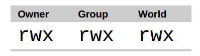
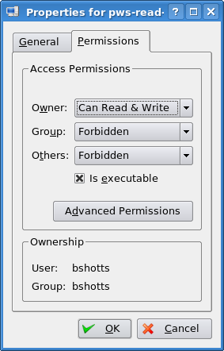

Unix 传统中的操作系统不同于那些 MS-DOS 传统中的系统，区别在于它们不仅是多任务系统，而且也是
多用户系统。这到底意味着什么？它意味着多个用户可以在同一时间使用同一台计算机。然而一个
典型的计算机可能只有一个键盘和一个监视器，但是它仍然可以被多个用户使用。例如，如果一台
计算机连接到一个网络或者因特网，那么远程用户通过 ssh（安全 shell）可以登录并操纵这台电脑。
事实上，远程用户也能运行图形界面应用程序，并且图形化的输出结果会出现在远端的显示器上。
X 窗口系统把这个作为基本设计理念的一部分，并支持这种功能。

Linux 系统的多用户性能，不是最近的“创新”，而是一种特性，它深深地嵌入到了 Linux 操作系统的
设计过程中。想一下 Unix 系统的诞生环境，这会很有意义。多年前，在个人电脑出现之前，计算机
都是大型的，昂贵的，集中化的。一个典型的大学计算机系统，例如，是由坐落在一座建筑中的一台
大型中央计算机和许多散布在校园各处的终端机组成，每个终端都连接到这台大型中央计算机。
这台计算机可以同时支持很多用户。

为了使多用户特性付诸实践，那么必须发明一种方法来阻止用户彼此之间受到影响。毕竟，一个
用户的行为不能导致计算机崩溃，也不能乱动属于另一个用户的文件。

在这一章中，我们将看看这一系统安全的本质部分，会介绍以下命令：

* id – 显示用户身份号

* chmod – 更改文件模式

* umask – 设置默认的文件权限

* su – 以另一个用户的身份来运行 shell

* sudo – 以另一个用户的身份来执行命令

* chown – 更改文件所有者

* chgrp – 更改文件组所有权

* passwd – 更改用户密码

### 拥有者，组成员，和其他人

在第四章探究文件系统时，当我们试图查看一个像/etc/shadow 那样的文件的时候，我们会遇到一个问题。

    [me@linuxbox ~]$ file /etc/shadow
    /etc/shadow:  regular file, no read permission
    [me@linuxbox ~]$ less /etc/shadow
    /etc/shadow:  Permission denied

产生这种错误信息的原因是，作为一个普通用户，我们没有权限来读取这个文件。

在 Unix 安全模型中，一个用户可能拥有文件和目录。当一个用户拥有一个文件或目录时，
用户对这个文件或目录的访问权限拥有控制权。用户，反过来，又属于一个由一个或多个
用户组成的用户组，用户组成员由文件和目录的所有者授予对文件和目录的访问权限。除了
对一个用户组授予权限之外，文件所有者可能会给每个人一些权限，在 Unix 术语中，每个人
是指整个世界。可以用 id 命令，来找到关于你自己身份的信息：

    [me@linuxbox ~]$ id
    uid=500(me) gid=500(me) groups=500(me)

让我们看一下输出结果。当用户创建帐户之后，系统会给用户分配一个号码，叫做用户 ID
或者 uid，然后，为了符合人类的习惯，这个 ID 映射到一个用户名。系统又会给这个用户
分配一个原始的组 ID 或者是 gid，这个 gid 可能属于另外的组。上面的例子来自于 Fedora 系统，
比方说 Ubuntu 的输出结果可能看起来有点儿不同：

    [me@linuxbox ~]$ id
    uid=1000(me) gid=1000(me)
    groups=4(adm),20(dialout),24(cdrom),25(floppy),29(audio),30(dip),44(v
    ideo),46(plugdev),108(lpadmin),114(admin),1000(me)

正如我们能看到的，两个系统中用户的 uid 和 gid 号码是不同的。原因很简单，因为 Fedora 系统
从500开始进行普通用户帐户的编号，而 Ubuntu 从1000开始。我们也能看到 Ubuntu 的用户属于
更多的用户组。这和 Ubuntu 管理系统设备和服务权限的方式有关系。

那么这些信息来源于哪里呢？像 Linux 系统中的许多东西一样，来自一系列的文本文件。用户帐户
定义在/etc/passwd 文件里面，用户组定义在/etc/group 文件里面。当用户帐户和用户组创建以后，
这些文件随着文件/etc/shadow 的变动而修改，文件/etc/shadow 包含了关于用户密码的信息。
对于每个用户帐号，文件/etc/passwd 定义了用户（登录）名，uid，gid，帐号的真实姓名，家目录，
和登录 shell。如果你查看一下文件/etc/passwd 和文件/etc/group 的内容，你会注意到除了普通
用户帐号之外，还有超级用户（uid 0）帐号，和各种各样的系统用户。

在下一章中，当我们讨论进程时，你会知道这些其他的“用户”是谁，实际上，他们相当忙碌。

然而许多像 Unix 的系统会把普通用户分配到一个公共的用户组中，例如“users”，现在的 Linux
会创建一个独一无二的，只有一个成员的用户组，这个用户组与用户同名。这样使某种类型的
权限分配更容易些。

### 读取，写入，和执行

对于文件和目录的访问权力是根据读访问，写访问，和执行访问来定义的。如果我们看一下 ls
命令的输出结果，我们能得到一些线索，这是怎样实现的：

    [me@linuxbox ~]$ > foo.txt
    [me@linuxbox ~]$ ls -l foo.txt
    -rw-rw-r-- 1 me   me   0 2008-03-06 14:52 foo.txt

列表的前十个字符是文件的属性。这十个字符的第一个字符表明文件类型。下表是你可能经常看到
的文件类型（还有其它的，不常见类型）：

<table class="multi">
<caption class="cap">表10-1: 文件类型</caption>
<tr>
<th class="title" width="15%">属性</th>
<th class="title">文件类型</th>
</tr>
<tr>
<td valign="top">-</td>
<td valign="top">一个普通文件</td>
</tr>
<tr>
<td valign="top">d </td>
<td valign="top">一个目录</td>
</tr>
<tr>
<td valign="top">l</td>
<td valign="top"> 一个符号链接。注意对于符号链接文件，剩余的文件属性总是"rwxrwxrwx"，而且都是
虚拟值。真正的文件属性是指符号链接所指向的文件的属性。</td>
</tr>
<tr>
<td valign="top">c</td>
<td valign="top"> 一个字符设备文件。这种文件类型是指按照字节流，来处理数据的设备。
比如说终端机，或者调制解调器</td>
</tr>
<tr>
<td valign="top">b</td>
<td valign="top"> 一个块设备文件。这种文件类型是指按照数据块，来处理数据的设备，例如一个硬盘，或者 CD-ROM 盘。 </td>
</tr>
</table>

剩下的九个字符，叫做文件模式，代表着文件所有者，文件组所有者，和其他人的读，写，执行权限。

 \\
图 1: 权限属性
{: .figure}

当设置文件模式后，r，w，x 模式属性对文件和目录会产生以下影响：

<table class="multi">
<caption class="cap">表 10-2: 权限属性</caption>
<tr>
<th class="title" width="15%">属性</th>
<th class="title">文件</th>
<th class="title">目录</th>
</tr>
<tr>
<td valign="top">r</td>
<td valign="top">允许打开并读取文件内容。</td>
<td valign="top">允许列出目录中的内容，前提是目录必须设置了可执行属性（x）。</td>
</tr>
<tr>
<td valign="top">w</td>
<td valign="top">允许写入文件内容或截断文件。但是不允许对文件进行重命名或删除，重命名或删除是由目录的属性决定的。</td>
<td valign="top">允许在目录下新建、删除或重命名文件，前提是目录必须设置了可执行属性（x）。</td>
</tr>
<tr>
<td valign="top">x</td>
<td valign="top">允许将文件作为程序来执行，使用脚本语言编写的程序必须设置为可读才能被执行。</td>
<td valign="top">允许进入目录，例如：cd directory 。</td>
</tr>
</table>

下面是权限属性的一些例子：

<table class="multi">
<caption class="cap">表 10-3: 权限属性示例</caption>
<tr>
<th class="title" width="15%">文件属性</th>
<th class="title">含义</th>
</tr>
<tr>
<td valign="top">-rwx------</td>
<td valign="top">一个普通文件，对文件所有者来说可读、可写、可执行。其他人无法访问。</td>
</tr>
<tr>
<td valign="top">-rw-------</td>
<td valign="top">一个普通文件，对文件所有者来说可读可写。其他人无法访问。</td>
</tr>
<tr>
<td valign="top">-rw-r--r--</td>
<td valign="top">一个普通文件，对文件所有者来说可读可写，文件所有者的组成员可以读该文件，其他所有人都可以读该文件。</td>
</tr>
<tr>
<td valign="top">-rwxr-xr-x</td>
<td valign="top">一个普通文件，对文件所有者来说可读、可写、可执行。也可以被其他的所有人读取和执行。</td>
</tr>
<tr>
<td valign="top">-rw-rw----</td>
<td valign="top">一个普通文件，对文件所有者以及文件所有者的组成员来说可读可写。</td>
</tr>
<tr>
<td valign="top">lrwxrwxrwx</td>
<td valign="top">一个符号链接，符号链接的权限都是虚拟的，真实的权限应该以符号链接指向的文件为准。</td>
</tr>
<tr>
<td valign="top">drwxrwx---</td>
<td valign="top">一个目录，文件所有者以及文件所有者的组成员可以访问该目录，并且可以在该目录下新建、重命名、删除文件。</td>
</tr>
<tr>
<td valign="top">drwxr-x---</td>
<td valign="top">一个目录，文件所有者可以访问该目录，并且可以在该目录下新建、重命名、删除文件，文件所有者的组成员可以访问该目录，但是不能新建、重命名、删除文件。</td>
</tr>
</table>

### chmod － 更改文件模式

更改文件或目录的模式（权限），可以利用 chmod 命令。注意只有文件的所有者或者超级用户才
能更改文件或目录的模式。chmod 命令支持两种不同的方法来改变文件模式：八进制数字表示法，或
符号表示法。首先我们讨论一下八进制数字表示法。

>
> 究竟什么是八进制？
>
> 八进制（以8为基数），和她的亲戚，十六进制（以16为基数）都是数字系统，通常
被用来表示计算机中的数字。我们人类，因为这个事实（或者至少大多数人）天生具有
十个手指，利用以10为基数的数字系统来计数。计算机，从另一方面讲，生来只有一个
手指，因此它以二进制（以2为基数）来计数。它们的数字系统只有两个数值，0和1。
因此在二进制中，计数看起来像这样：
>
>  0, 1, 10, 11, 100, 101, 110, 111, 1000, 1001, 1010, 1011...
>
> 在八进制中，逢八进一，用数字0到7来计数，像这样：
>
>  0, 1, 2, 3, 4, 5, 6, 7, 10, 11, 12, 13, 14, 15, 16, 17, 20, 21...
>
> 十六进制中，使用数字0到9，加上大写字母"A"到"F"来计数，逢16进一：
>
>  0, 1, 2, 3, 4, 5, 6, 7, 8, 9, A, B, C, D, E, F, 10, 11, 12, 13...
>
> 虽然我们能知道二进制的意义（因为计算机只有一个手指），但是八进制和十六进制对什么
好处呢？ 答案是为了人类的便利。许多时候，在计算机中，一小部分数据以二进制的形式表示。
以 RGB 颜色为例来说明。大多数的计算机显示器，每个像素由三种颜色组成：8位红色，8位绿色，
8位蓝色。这样，一种可爱的中蓝色就由24位数字来表示：
>
>  010000110110111111001101
>
> 我不认为你每天都喜欢读写这类数字。另一种数字系统对我们更有帮助。每个十六进制
数字代表四个二进制。在八进制中，每个数字代表三个二进制数字。那么代表中蓝色的24位
二进制能够压缩成6位十六进制数：
>
>  436FCD
>
> 因为十六进制中的两个数字对应二进制的8位数字，我们可以看到”43“代表红色，“6F”
代表绿色，“CD”代表蓝色。
>
> 现在，十六进制表示法（经常叫做“hex”）比八进制更普遍，但是我们很快会看到，用八进制
来表示3个二进制数非常有用处...

通过八进制表示法，我们使用八进制数字来设置所期望的权限模式。因为每个八进制数字代表了
3个二进制数字，这种对应关系，正好映射到用来存储文件模式所使用的方案上。下表展示了
我们所要表达的意思：

|Octal| Binary | File Mode|
|0 | 000 | -\-\-|
|1 | 001 | -\-x|
|2 | 010 | -w-|
|3 | 011 | -wx|
|4 | 100 | r-\-|
|5 | 101 | r-x|
|6 | 110 | rw-|
|7 | 111 | rwx|

通过使用3个八进制数字，我们能够设置文件所有者，用户组，和其他人的权限：

    [me@linuxbox ~]$ > foo.txt
    [me@linuxbox ~]$ ls -l foo.txt
    -rw-rw-r-- 1 me    me    0  2008-03-06 14:52 foo.txt
    [me@linuxbox ~]$ chmod 600 foo.txt
    [me@linuxbox ~]$ ls -l foo.txt
    -rw------- 1 me    me    0  2008-03-06 14:52 foo.txt

通过传递参数 “600”，我们能够设置文件所有者的权限为读写权限，而删除用户组和其他人的所有
权限。虽然八进制到二进制的映射看起来不方便，但通常只会用到一些常见的映射关系：
7 (rwx)，6 (rw-)，5 (r-x)，4 (r-\-)，和 0 (-\-\-)。

chmod 命令支持一种符号表示法，来指定文件模式。符号表示法分为三部分：更改会影响谁，
要执行哪个操作，要设置哪种权限。通过字符 “u”，“g”，“o”，和 “a” 的组合来指定
要影响的对象，如下所示：

<table class="multi">
<caption class="cap">表10-4: chmod 命令符号表示法 </caption>
<tr>
<td class="title" width="15%">u</td>
<td class="title"> "user"的简写，意思是文件或目录的所有者。</td>
</tr>
<tr>
<td valign="top">g</td>
<td valign="top"> 用户组。</td>
</tr>
<tr>
<td valign="top">o</td>
<td valign="top"> "others"的简写，意思是其他所有的人。</td>
</tr>
<tr>
<td valign="top">a</td>
<td valign="top"> "all"的简写，是"u", "g"和“o”三者的联合。</td>
</tr>
</table>

如果没有指定字符，则假定使用"all"。执行的操作可能是一个“＋”字符，表示加上一个权限，
一个“－”，表示删掉一个权限，或者是一个“＝”，表示只有指定的权限可用，其它所有的权限被删除。

权限由 “r”，“w”，和 “x” 来指定。这里是一些符号表示法的实例：

<table class="multi">
<caption class="cap">表10-5: chmod 符号表示法实例 </caption>
<tr>
<td class="title" width="15%">u+x </td>
<td class="title"> 为文件所有者添加可执行权限。</td>
</tr>
<tr>
<td valign="top">u-x</td>
<td valign="top"> 删除文件所有者的可执行权限。</td>
</tr>
<tr>
<td valign="top">+x</td>
<td valign="top"> 为文件所有者，用户组，和其他所有人添加可执行权限。 等价于 a+x。</td>
</tr>
<tr>
<td valign="top">o-rw</td>
<td valign="top"> 除了文件所有者和用户组，删除其他人的读权限和写权限。</td>
</tr>
<tr>
<td valign="top">go=rw</td>
<td valign="top"> 给群组的主人和任意文件拥有者的人读写权限。如果群组的主人或全局之前已经有了执行的权限，他们将被移除。 </td>
</tr>
<tr>
<td valign="top">u+x,go=rw</td>
<td valign="top"> 给文件拥有者执行权限并给组和其他人读和执行的权限。多种设定可以用逗号分开。</td>
</tr>
</table>

一些人喜欢使用八进制表示法，而另一些人则非常喜欢符号表示法。符号表示法的优点是，
允许你设置文件模式的某个属性，而不影响其他的属性。

看一下 chmod 命令的手册页，可以得到更详尽的信息和 chmod 命令的各个选项。要注意"-\-recursive"选项：
它可以同时作用于文件和目录，所以它并不是如我们期望的那么有用处，因为我们很少希望文件和
目录拥有同样的权限。

### 借助 GUI 来设置文件模式

现在我们已经知道了怎样设置文件和目录的权限，这样我们就可以更好的理解 GUI 中的设置
权限对话框。在 Nautilus (GNOME)和 Konqueror
(KDE)中，右击一个文件或目录图标将会弹出一个属性对话框。下面这个例子来自 KDE 3.5：

 \\
图 2: KDE 3.5 文件属性对话框
{: .figure}

从这个对话框中，我们看到可以设置文件所有者，用户组，和其他人的访问权限。
在 KDE 中，右击"Advanced Permissions"按钮，会打开另一个对话框，这个对话框允许
你单独设置各个模式属性。这也可以通过命令行来理解！

### umask － 设置默认权限

当创建一个文件时，umask 命令控制着文件的默认权限。umask 命令使用八进制表示法来表达
从文件模式属性中删除一个位掩码。大家看下面的例子：

    [me@linuxbox ~]$ rm -f foo.txt
    [me@linuxbox ~]$ umask
    0002
    [me@linuxbox ~]$ > foo.txt
    [me@linuxbox ~]$ ls -l foo.txt
    -rw-rw-r-- 1 me   me   0 2008-03-06 14:53 foo.txt

首先，删除文件 foo.txt，以此确定我们从新开始。下一步，运行不带参数的 umask 命令，
看一下当前的掩码值。响应的数值是0002（0022是另一个常用值），这个数值是掩码的八进制
表示形式。下一步，我们创建文件 foo.txt，并且保留它的权限。

我们可以看到文件所有者和用户组都得到读权限和写权限，而其他人只是得到读权限。
其他人没有得到写权限的原因是由掩码值决定的。重复我们的实验，这次自己设置掩码值：

    [me@linuxbox ~]$ rm foo.txt
    [me@linuxbox ~]$ umask 0000
    [me@linuxbox ~]$ > foo.txt
    [me@linuxbox ~]$ ls -l foo.txt
    -rw-rw-rw- 1 me   me    0 2008-03-06 14:58 foo.txt

当掩码设置为0000（实质上是关掉它）之后，我们看到其他人能够读写文件。为了弄明白这是
怎么回事，我们需要看一下掩码的八进制形式。把掩码展开成二进制形式，然后与文件属性
相比较，看看有什么区别：

|Original file mode | -\-\- rw- rw- rw-|
|Mask | 000 000 000 010|
|Result | -\-- rw- rw- r-\-|

此刻先忽略掉开头的三个零（我们一会儿再讨论），注意掩码中若出现一个数字1，则
删除文件模式中和这个1在相同位置的属性，在这是指其他人的写权限。这就是掩码要完成的
任务。掩码的二进制形式中，出现数字1的位置，相应地关掉一个文件模式属性。看一下
掩码0022的作用：

|Original file mode | -\-\- rw- rw- rw-|
|Mask | 000 000 010 010|
|Result | -\-- rw- r-\- r-\-|

又一次，二进制中数字1出现的位置，相对应的属性被删除。再试一下其它的掩码值（一些带数字7的）
，习惯于掩码的工作原理。当你实验完成之后，要记得清理现场：

    [me@linuxbox ~]$ rm foo.txt; umask 0002

大多数情况下，你不必修改掩码值，系统提供的默认掩码值就很好了。然而，在一些高
安全级别下，你要能控制掩码值。

>
> 一些特殊权限
>
> 虽然我们通常看到一个八进制的权限掩码用三位数字来表示，但是从技术层面上来讲，
用四位数字来表示它更确切些。为什么呢？因为，除了读取，写入，和执行权限之外，还有
其它的，较少用到的权限设置。
>
> 其中之一是 setuid 位（八进制4000)。当应用到一个可执行文件时，它把有效用户 ID
从真正的用户（实际运行程序的用户）设置成程序所有者的 ID。这种操作通常会应用到
一些由超级用户所拥有的程序。当一个普通用户运行一个程序，这个程序由根用户(root)
所有，并且设置了 setuid 位，这个程序运行时具有超级用户的特权，这样程序就可以
访问普通用户禁止访问的文件和目录。很明显，因为这会引起安全方面的问题，所有可以
设置 setuid 位的程序个数，必须控制在绝对小的范围内。
>
> 第二个是 setgid 位（八进制2000），这个相似于 setuid 位，把有效用户组 ID 从真正的
用户组 ID 更改为文件所有者的组 ID。如果设置了一个目录的 setgid 位，则目录中新创建的文件
具有这个目录用户组的所有权，而不是文件创建者所属用户组的所有权。对于共享目录来说，
当一个普通用户组中的成员，需要访问共享目录中的所有文件，而不管文件所有者的主用户组时，
那么设置 setgid 位很有用处。
>
> 第三个是 sticky 位（八进制1000）。这个继承于 Unix，在 Unix 中，它可能把一个可执行文件
标志为“不可交换的”。在 Linux 中，会忽略文件的 sticky 位，但是如果一个目录设置了 sticky 位，
那么它能阻止用户删除或重命名文件，除非用户是这个目录的所有者，或者是文件所有者，或是
超级用户。这个经常用来控制访问共享目录，比方说/tmp。
>
> 这里有一些例子，使用 chmod 命令和符号表示法，来设置这些特殊的权限。首先，
授予一个程序 setuid 权限。
>
>  _chmod u+s program_
>
> 下一步，授予一个目录 setgid 权限：
>
>  _chmod g+s dir_
>
> 最后，授予一个目录 sticky 权限：
>
>  _chmod +t dir_
>
> 当浏览 ls 命令的输出结果时，你可以确认这些特殊权限。这里有一些例子。首先，一个程序被设置为setuid属性：
>
>  _-rwsr-xr-x_
>
> 具有 setgid 属性的目录：
>
>  _drwxrwsr-x_
>
> 设置了 sticky 位的目录：
>
>  _drwxrwxrwt_

### 更改身份

在不同的时候，我们会发现很有必要具有另一个用户的身份。经常地，我们想要得到超级
用户特权，来执行一些管理任务，但是也有可能"变为"另一个普通用户，比如说测试一个帐号。
有三种方式，可以拥有多重身份：

1. 注销系统并以其他用户身份重新登录系统。

2. 使用 su 命令。

3. 使用 sudo 命令。

我们将跳过第一种方法，因为我们知道怎样使用它，并且它缺乏其它两种方法的方便性。
在我们自己的 shell 会话中，su 命令允许你，假定为另一个用户的身份，以这个用户的 ID
启动一个新的 shell 会话，或者是以这个用户的身份来发布一个命令。sudo 命令允许一个管理员
设置一个叫做/etc/sudoers 的配置文件，并且定义了一些具体命令，在假定的身份下，特殊用户
可以执行这些命令。选择使用哪个命令，很大程度上是由你使用的 Linux 发行版来决定的。
你的发行版可能这两个命令都包含，但系统配置可能会偏袒其中之一。我们先介绍 su 命令。

### su － 以其他用户身份和组 ID 运行一个 shell

su 命令用来以另一个用户的身份来启动 shell。这个命令语法看起来像这样：

    su [-[l]] [user]

如果包含"-l"选项，那么会为指定用户启动一个需要登录的 shell。这意味着会加载此用户的 shell 环境，
并且工作目录会更改到这个用户的家目录。这通常是我们所需要的。如果不指定用户，那么就假定是
超级用户。注意（不可思议地），选项"-l"可以缩写为"-"，这是经常用到的形式。启动超级用户的 shell，
我们可以这样做：

    [me@linuxbox ~]$ su -
    Password:
    [root@linuxbox ~]#

按下回车符之后，shell 提示我们输入超级用户的密码。如果密码输入正确，出现一个新的 shell 提示符，
这表明这个 shell 具有超级用户特权（提示符的末尾字符是"#"而不是"$"），并且当前工作目录是超级用户的家目录
（通常是/root）。一旦进入一个新的 shell，我们能执行超级用户所使用的命令。当工作完成后，
输入"exit"，则返回到原来的 shell:

    [root@linuxbox ~]# exit
    [me@linuxbox ~]$

以这样的方式使用 su 命令，也可以只执行单个命令，而不是启动一个新的可交互的 shell：

    su -c 'command'

使用这种模式，命令传递到一个新 shell 中执行。把命令用单引号引起来很重要，因为我们不想
命令在我们的 shell 中展开，但需要在新 shell 中展开。

    [me@linuxbox ~]$ su -c 'ls -l /root/*'
    Password:
    -rw------- 1 root root    754 2007-08-11 03:19 /root/anaconda-ks.cfg

    /root/Mail:
    total 0
    [me@linuxbox ~]$

### sudo － 以另一个用户身份执行命令

sudo 命令在很多方面都相似于 su 命令，但是 sudo 还有一些非常重要的功能。管理员能够配置
sudo 命令，从而允许一个普通用户以不同的身份（通常是超级用户），通过一种非常可控的方式
来执行命令。尤其是，只有一个用户可以执行一个或多个特殊命令时，（更体现了 sudo 命令的方便性）。
另一个重要差异是 sudo 命令不要求超级用户的密码。使用 sudo 命令时，用户使用他/她自己的密码
来认证。比如说，例如，sudo 命令经过配置，允许我们运行一个虚构的备份程序，叫做"backup_script"，
这个程序要求超级用户权限。通过 sudo 命令，这个程序会像这样运行：

    [me@linuxbox ~]$ sudo backup_script
    Password:
    System Backup Starting...

按下回车键之后，shell 提示我们输入我们的密码（不是超级用户的）。一旦认证完成，则执行
具体的命令。su 和 sudo 之间的一个重要区别是 sudo 不会重新启动一个 shell，也不会加载另一个
用户的 shell 运行环境。这意味者命令不必用单引号引起来。注意通过指定各种各样的选项，这
种行为可以被推翻。详细信息，阅读 sudo 手册页。

想知道 sudo 命令可以授予哪些权限，使用"-l"选项，列出所有权限：

    [me@linuxbox ~]$ sudo -l
    User me may run the following commands on this host:
    (ALL) ALL

>
> Ubuntu 与 sudo
>
> 普通用户经常会遇到这样的问题，怎样完成某些需要超级用户权限的任务。这些任务
包括安装和更新软件，编辑系统配置文件，和访问设备。在 Windows 世界里，这些任务是
通过授予用户管理员权限来完成的。这允许用户执行这些任务。然而，这也会导致用户所
执行的程序拥有同样的能力。在大多数情况下，这是我们所期望的，但是它也允许 malware
（恶意软件），比方说电脑病毒，自由地支配计算机。
>
> 在 Unix 世界中，由于 Unix 是多用户系统，所以在普通用户和管理员之间总是存在很大的
差别。Unix 采取的方法是只有在需要的时候，才授予普通用户超级用户权限。这样，普遍会
用到 su 和 sudo 命令。
>
> 几年前，大多数的 Linux 发行版都依赖于 su 命令，来达到目的。su 命令不需要 sudo 命令
所要求的配置，su 命令拥有一个 root 帐号，是 Unix 中的传统。但这会引起问题。所有用户
会企图以 root 用户帐号来操纵系统。事实上，一些用户专门以 root 用户帐号来操作系统，
因为这样做，的确消除了所有那些讨厌的“权限被拒绝”的消息。你这样做就会使得 Linux 系统的
安全性能被降低到和 Windows 系统相同的级别。不是一个好主意。
>
> 当引进 Ubuntu 的时候，它的创作者们采取了不同的策略。默认情况下，Ubuntu 不允许用户登录
到 root 帐号（因为不能为 root 帐号设置密码），而是使用 sudo 命令授予普通用户超级用户权限。
通过 sudo 命令，最初的用户可以拥有超级用户权限，也可以授予随后的用户帐号相似的权力。

### chown － 更改文件所有者和用户组

chown 命令被用来更改文件或目录的所有者和用户组。使用这个命令需要超级用户权限。chown 命令
的语法看起来像这样：

    chown [owner][:[group]] file...

chown 可以根据这个命令的第一个参数更改文件所有者和/或文件用户组。这里有
一些例子：

<table class="multi">
<caption class="cap">表10-6: chown 参数实例</caption>
<tr>
<th class="title">参数</th>
<th class="title">结果</th>
</tr>
<tr>
<td valign="top" width="15%">bob</td>
<td valign="top"> 把文件所有者从当前属主更改为用户 bob。</td>
</tr>
<tr>
<td valign="top">bob:users</td>
<td valign="top"> 把文件所有者改为用户 bob，文件用户组改为用户组 users。</td>
</tr>
<tr>
<td valign="top">:admins</td>
<td valign="top"> 把文件用户组改为组 admins，文件所有者不变。</td>
</tr>
<tr>
<td valign="top">bob:</td>
<td valign="top"> 文件所有者改为用户 bob，文件用户组改为，用户 bob 登录系统时，所属的用户组。</td>
</tr>
</table>

比方说，我们有两个用户，janet，拥有超级用户访问权限，而 tony 没有。用户 jant 想要从
她的家目录复制一个文件到用户 tony 的家目录。因为用户 jant 想要 tony 能够编辑这个文件，
janet 把这个文件的所有者更改为 tony:

    [janet@linuxbox ~]$ sudo cp myfile.txt ~tony
    Password:
    [janet@linuxbox ~]$ sudo ls -l ~tony/myfile.txt
    -rw-r--r-- 1 root  root 8031 2008-03-20 14:30 /home/tony/myfile.txt
    [janet@linuxbox ~]$ sudo chown tony: ~tony/myfile.txt
    [janet@linuxbox ~]$ sudo ls -l ~tony/myfile.txt
    -rw-r--r-- 1 tony  tony 8031 2008-03-20 14:30 /home/tony/myfile.txt

这里，我们看到用户 janet 把文件从她的目录复制到 tony 的家目录。下一步，janet 把文件所有者
从 root（使用 sudo 命令的原因）改到 tony。通过在第一个参数中使用末尾的":"字符，janet 同时把
文件用户组改为 tony 登录系统时，所属的用户组，碰巧是用户组 tony。

注意，第一次使用 sudo 命令之后，为什么（shell）没有提示 janet 输入她的密码？这是因为，在
大多数的配置中，sudo 命令会相信你几分钟，直到计时结束。

### chgrp － 更改用户组所有权

在旧版 Unix 系统中，chown 命令只能更改文件所有权，而不是用户组所有权。为了达到目的，
使用一个独立的命令，chgrp 来完成。除了限制多一点之外，chgrp 命令与 chown 命令使用起来很相似。

### 练习使用权限

到目前为止，我们已经知道了，权限这类东西是怎样工作的，现在是时候炫耀一下了。我们
将展示一个常见问题的解决方案，这个问题是如何设置一个共享目录。假想我们有两个用户，
他们分别是 "bill" 和 "karen"。他们都有音乐 CD 收藏品，也愿意设置一个共享目录，在这个
共享目录中，他们分别以 Ogg Vorbis 或 MP3 的格式来存储他们的音乐文件。通过 sudo 命令，
用户 bill 具有超级用户访问权限。

我们需要做的第一件事，是创建一个以 bill 和 karen 为成员的用户组。使用图形化的用户管理工具，
bill 创建了一个叫做 music 的用户组，并且把用户 bill 和 karen 添加到用户组 music 中：

 \\
图 3: 用 GNOME 创建一个新的用户组
{: .figure}

下一步，bill 创建了存储音乐文件的目录：

    [bill@linuxbox ~]$ sudo mkdir /usr/local/share/Music
    password:

因为 bill 正在他的家目录之外操作文件，所以需要超级用户权限。这个目录创建之后，它具有
以下所有权和权限：

    [bill@linuxbox ~]$ ls -ld /usr/local/share/Music
    drwxr-xr-x 2 root root 4096 2008-03-21 18:05 /usr/local/share/Music

正如我们所见到的，这个目录由 root 用户拥有，并且具有权限755。为了使这个目录共享，允许（用户
karen）写入，bill 需要更改目录用户组所有权和权限：

    [bill@linuxbox ~]$ sudo chown :music /usr/local/share/Music
    [bill@linuxbox ~]$ sudo chmod 775 /usr/local/share/Music
    [bill@linuxbox ~]$ ls -ld /usr/local/share/Music
    drwxrwxr-x 2 root music 4096 2008-03-21 18:05 /usr/local/share/Music

那么这是什么意思呢？
它的意思是，现在我们拥有一个目录，/usr/local/share/Music，这个目录由 root 用户拥有，并且
允许用户组 music 读取和写入。用户组 music 有两个成员 bill 和 karen，这样 bill 和 karen 能够在目录
/usr/local/share/Music 中创建文件。其他用户能够列出目录中的内容，但是不能在其中创建文件。

但是我们仍然会遇到问题。通过我们目前所拥有的权限，在 Music 目录中创建的文件，只具有用户 bill
和 karen 的普通权限：

    [bill@linuxbox ~]$ > /usr/local/share/Music/test_file
    [bill@linuxbox ~]$ ls -l /usr/local/share/Music
    -rw-r--r-- 1 bill    bill    0 2008-03-24 20:03 test_file

实际上，存在两个问题。第一个，系统中默认的掩码值是0022，这会禁止用户组成员编辑属于同
组成员的文件。如果共享目录中只包含文件，这就不是个问题，但是因为这个目录将会存储音乐，
通常音乐会按照艺术家和唱片的层次结构来组织分类。所以用户组成员需要在同组其他成员创建的
目录中创建文件和目录。我们将把用户 bill 和 karen 使用的掩码值改为0002。

第二个问题是，用户组成员创建的文件和目录的用户组，将会设置为用户的主要组，而不是用户组 music。
通过设置此目录的 setgid 位来解决这个问题：

    [bill@linuxbox ~]$ sudo chmod g+s /usr/local/share/Music
    [bill@linuxbox ~]$ ls -ld /usr/local/share/Music
    drwxrwsr-x 2 root music 4096 2008-03-24 20:03 /usr/local/share/Music

现在测试一下，看看是否新的权限解决了这个问题。bill 把他的掩码值设为0002，删除
先前的测试文件，并创建了一个新的测试文件和目录：

    [bill@linuxbox ~]$ umask 0002

    [bill@linuxbox ~]$ rm /usr/local/share/Music/test_file

    [bill@linuxbox ~]$ > /usr/local/share/Music/test_file
    [bill@linuxbox ~]$ mkdir /usr/local/share/Music/test_dir
    [bill@linuxbox ~]$ ls -l /usr/local/share/Music
    drwxrwsr-x 2 bill   music 4096 2008-03-24 20:24 test_dir
    -rw-rw-r-- 1 bill   music 0 2008-03-24 20:22 test_file
    [bill@linuxbox ~]$

现在，创建的文件和目录都具有正确的权限，允许用户组 music 的所有成员在目录 Music 中创建
文件和目录。

剩下一个问题是关于 umask 命令的。umask 命令设置的掩码值只能在当前 shell 会话中生效，若当前 shell
会话结束后，则必须重新设置。在这本书的第三部分，我们将看一下，怎样使掩码值永久生效。

### 更改用户密码

这一章最后一个话题，我们将讨论自己帐号的密码（和其他人的密码，如果你具有超级用户权限）。
使用 passwd 命令，来设置或更改用户密码。命令语法如下所示：

    passwd [user]

只要输入 passwd 命令，就能更改你的密码。shell 会提示你输入你的旧密码和你的新密码：

    [me@linuxbox ~]$ passwd
    (current) UNIX password:
    New UNIX password:

passwd 命令将会试着强迫你使用“强”密码。这意味着，它会拒绝接受太短的密码，与先前相似的密码，
字典中的单词作为密码，或者是太容易猜到的密码：

    [me@linuxbox ~]$ passwd
    (current) UNIX password:
    New UNIX password:
    BAD PASSWORD: is too similar to the old one
    New UNIX password:
    BAD PASSWORD: it is WAY too short
    New UNIX password:
    BAD PASSWORD: it is based on a dictionary word

如果你具有超级用户权限，你可以指定一个用户名作为 passwd 命令的参数，这样可以设置另一个
用户的密码。还有其它的 passwd 命令选项对超级用户有效，允许帐号锁定，密码失效，等等。
详细内容，参考 passwd 命令的手册页。

### 拓展阅读

* Wikipedia 上面有一篇关于 malware（恶意软件）好文章：

    <http://en.wikipedia.org/wiki/Malware>

还有一系列的命令行程序，可以用来创建和维护用户和用户组。更多信息，查看以下命令的手册页：

* _adduser_

* _useradd_

* _groupadd_
